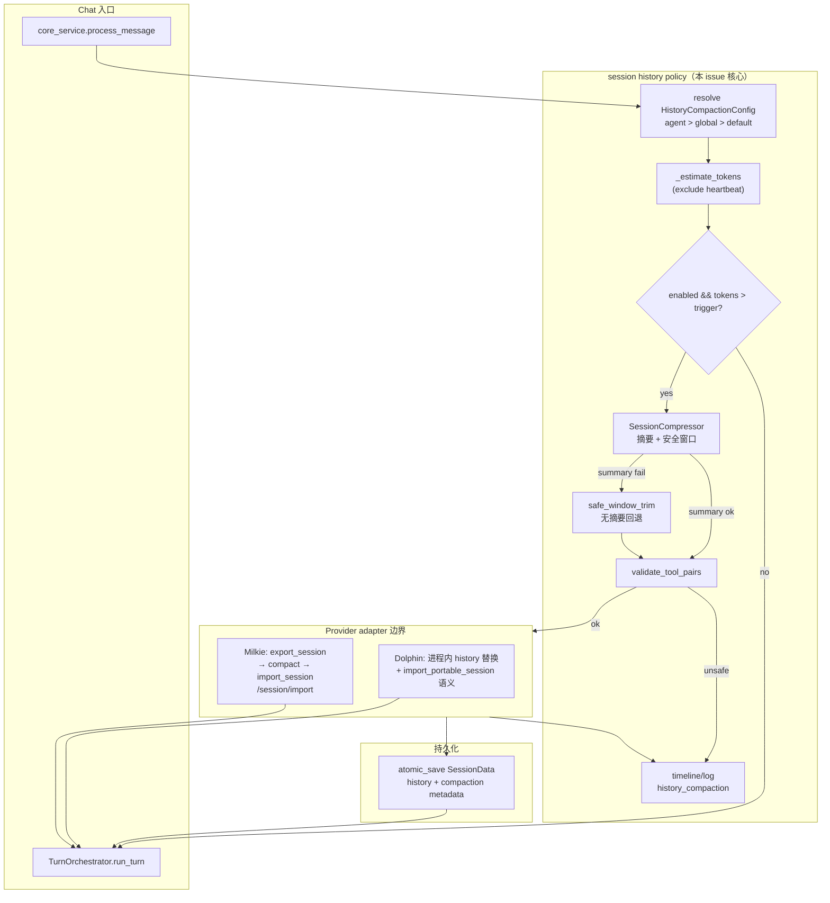
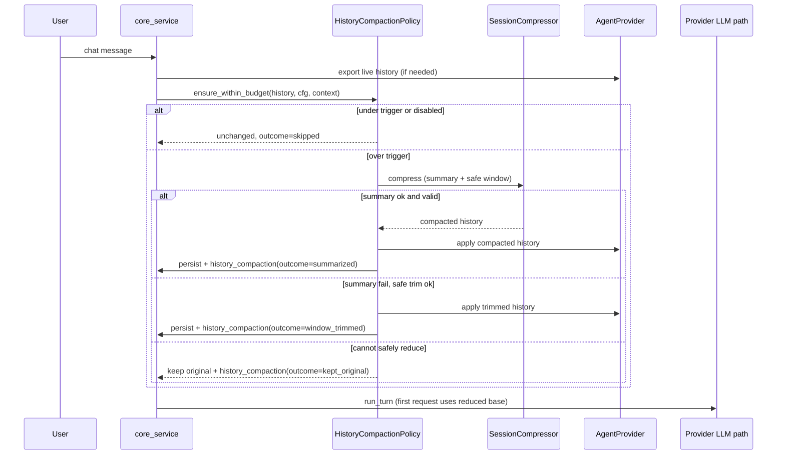

# 【session】长会话历史压缩，降低 chat turn 上下文底座

- Issue: #166
- 状态: Approved (petri code-dev run-002)
- 最后更新: 2026-07-21
- 来源: issue brief + design proposal（issue comment 3）；评审通过后 promote 为 `docs/design/166-long-session-history-compaction.md`

## 1. 背景

同一超时案例（session `tg_session_demo_agent__8576399597`，milkie run `7cb2fb03-…`）中，chat turn **第一轮** LLM 请求已约 **94074 inputTokens**（messages≈168，system + 历史主导）。本 turn 新增 tool 输出只是增量；巨大历史底座使每一轮 tool 决策更慢，更容易顶穿 600s 前台预算。仅做 tool 输出精简（#167）无法显著降低开场 tokens。

现状盘点（必须复用，禁止第二套处理器）：

| 能力 | 位置 | 现状缺口 |
|------|------|----------|
| Token 估算 `chars//3` | `history_utils._estimate_tokens` | 可用；常量 `COMPACT_TOKEN_BUDGET=40_000`、`COMPACT_WINDOW_TOKENS=20_000` |
| 摘要 + 滑动窗口 | `SessionCompressor.maybe_compress` / `compress_history` | 摘要失败直接 skip；窗口切点**不保证** tool 链边界安全 |
| 触发路径 | `session.py` / `persistence.py` save | **仅** `provider.needs_history_restore()==True`（Dolphin）时压缩；**Milkie 保存路径整段跳过** |
| Restore | `persistence.restore_to_agent` | Milkie `needs_history_restore()==False`，不灌回；serve 内历史原样进 `/chat` |
| 孤儿 tool 愈合 | `persistence._heal_orphan_tool_messages` | 仅 Dolphin restore；压缩器本身不产出合法序列保证 |
| 观测 / 配置 | 无 `history_compaction` 事件；阈值硬编码 | 不可配置、不可关、不可审计前后规模 |

与 #164 / #165 / #167 / #168 正交：本设计只降低「每轮固定历史底座」。

## 2. 名词解释

| 术语 | 含义 |
|------|------|
| **history 底座** | 进入本 turn 首个 LLM 请求时，除 system 与当轮新 input 外，由既有对话历史贡献的 input tokens |
| **trigger_tokens** | 对话历史（排除 heartbeat/placeholder）估算 token 超过该值时触发压缩 |
| **target_recent_tokens** | 压缩后保留的最近原文窗口 token 上限（摘要另计） |
| **summary pair** | 注入在历史头部的 `user`(含 `SUMMARY_TAG`) + `assistant`(摘要正文) 消息对 |
| **安全窗口裁剪** | 摘要失败时，在**不破坏 tool 配对**的前提下，丢弃旧消息、仅保留合法最近窗口（无摘要） |
| **orphan tool** | `role=tool` 消息在窗口内找不到对应 assistant `tool_calls[].id`；或反向悬空 `tool_call` 无 result（未完成链除外） |

## 3. 设计目标与非目标

### 目标

1. **S1 降本**：超阈值会话在可复现 fixture 上，首轮 LLM 请求 history/input tokens 较未压缩基线下降 **≥ 30%**；近期对话与未决任务仍可用。
2. **S2 可观测可配置**：触发时写结构化事件；`session.history_compaction` 可配置并有文档；可关闭应急回退。
3. **S3 结构与事实安全**：压缩后无 orphan tool；继续多轮 tool 不因非法序列报 provider 错；关键用户约束仍出现在上下文。
4. **S4 路径统一**：Dolphin 与 Milkie 共享同一 history-policy 入口；在**交给模型前**生效，不只在 save 后改磁盘镜像。
5. **S5 失败不阻断**：未达阈值零额外请求；摘要失败不导致 chat 失败，不把失败文本当摘要写入 history。

### 非目标

- 单次 tool result 的 resultStrategy / 大输出投影（#167）
- web search schema / objectId（#165）、软超时 deferred（#168）、thrash 防护（#164）
- 整会话迁移为长期记忆 / 向量检索
- 未达阈值时每轮强制摘要 LLM
- 依赖 provider repair 修复断配 tool 链
- 改 system prompt 或心跳策略本体（心跳隔离沿用现有 `compress_history` 逻辑）

## 4. 能力与功能设计

### 4.1 运行时行为（用户不可见；runtime 可见）

1. 用户发起新 chat turn。
2. 系统在 `run_turn` / provider 真正组 LLM 请求**之前**调用统一入口 `HistoryCompactionPolicy.ensure_within_budget(...)`。
3. 若未超阈值或 `enabled=false`：原样返回，无副作用。
4. 若超阈值：摘要旧段 + 保留安全 recent 窗口 → 回写 provider 运行态 history + 原子持久化 alfred session 镜像 → 写 `history_compaction` 事件。
5. 后续本 turn 的多轮 tool LLM 请求在**已压缩**历史底座上继续（本 turn 内不再重复摘要，除非另有配置；默认一次 turn 入口最多尝试一次）。

### 4.2 UI / UX

N/A — 无用户可见 UI。开发者通过 timeline/log 与配置观测。

## 5. 设计思路与折衷

### 5.1 候选方案

| 方案 | 做法 | 优点 | 缺点 | 结论 |
|------|------|------|------|------|
| A. 仅加强 save 路径压缩 | 去掉 milkie skip，save 时压缩 alfred JSONL | 改动小 | **不降低** milkie serve 内实际进模型的历史 | 否 |
| B. 仅滑动窗口丢弃旧消息 | 无摘要 | 无 LLM 成本 | 丢失用户约束/结论；难满足「关键事实仍可用」 | 否（仅作失败回退） |
| C. **恢复/首轮前预压缩 + 摘要 + 安全窗口**（选用） | 统一 policy；复用 `SessionCompressor`；成功后回写运行态 | 直接打底座；复用现有摘要；失败可降级 | 超阈值时多一次 fast LLM；需 milkie import | **是** |
| D. 全量摘要 / 向量记忆 | 历史全进 memory store | 长期可检索 | 超 scope、交付面过大 | 否 |

### 5.2 关键折衷

1. **摘要 + 有界原文窗口**：摘要保留约束/结论/未决事项；窗口保证近期 tool 可逐字引用。比纯丢弃更安全，比全量摘要更便宜可控。
2. **默认 40k trigger / 20k target**：与现网 `COMPACT_TOKEN_BUDGET` / `COMPACT_WINDOW_TOKENS` 一致，避免无依据换档；`max_summary_tokens` 默认 **2000**（覆盖现 prompt「不超过 500 字」并给配置留余量）。
3. **摘要失败 → 安全窗口裁剪 → 仍失败则保留原 history**：接受 issue 开放问题 #2 的「可安全裁剪」立场；**禁止静默删除**无法安全裁的消息。
4. **一次 turn 入口压缩一次**：避免 turn 内每 tool round 重复摘要；本 turn 新增消息仍可在**下次** turn 入口再压。
5. **不新建第二套 compressor**：扩展 `SessionCompressor` + 抽纯函数窗口/校验；入口命名为 policy 层，实现仍落在 `core/session/`。

## 6. 架构设计

### 6.1 逻辑分层



### 6.2 核心业务流程



**调用时机（硬要求）**

| 时机 | Dolphin | Milkie | 说明 |
|------|---------|--------|------|
| **Chat turn 首轮前**（主路径） | 是 | 是 | 满足 S1/S4；在 `core_service` 进入 `TurnOrchestrator.run_turn` 前，或 orchestrator 的 pre-turn hook |
| Save 后写盘 | 是（已有，改为走同一 policy） | 是（写 alfred JSONL 镜像；**不替代** serve 内压缩） | 磁盘与运行态一致 |
| Restore 灌回 | 是（灌回前 ensure） | N/A（不灌回） | 避免 restore 后立刻再撑爆 |

**Milkie 专属适配（S4 关键）**

1. `export_session` → alfred history dict 列表（已有 `POST /session/history`）。
2. Policy 压缩/裁剪纯函数结果。
3. **必须**把压缩后 history 写回 serve，否则首轮 LLM 仍用全量 sqlite 历史。对接 milkie 已交付的 **`POST /session/import`**（#124）：在 `MilkieProvider` 新增 `import_session(agent, portable)`（或等价 `replace_history`），将 summary pair + recent 窗口导入同一 `contextId`。
4. 同步 `atomic_save` alfred session JSONL（审计/记忆/导出用）。
5. 若 import 失败：记 `outcome=apply_failed`，**不**阻断 chat（S5）；运行态可能仍大，但行为可观测。实现上应优先保证 import 成功路径有 integration 覆盖。

**Dolphin 适配**

- 进程内替换 history（与现 `compress_history` 写回 list 一致），必要时经现有 portable import 路径保证 executor context 一致。
- Save 路径去掉「仅 needs_history_restore 才 compress」的误判：policy 对 primary/channel 会话统一可用；provider 差异只在 **apply** 层。

## 7. 模块设计

### 7.1 `HistoryCompactionConfig`（新，纯数据）

建议位置：`src/everbot/core/session/history_compaction.py`（或并入 `history_utils.py` 若文件仍短）。

```python
@dataclass(frozen=True)
class HistoryCompactionConfig:
    enabled: bool = True
    trigger_tokens: int = 40_000
    target_recent_tokens: int = 20_000
    max_summary_tokens: int = 2_000
```

解析优先级（对齐 `turn_policy._resolve_timeout` 风格）：

1. `everbot.agents.<agent_name>.session.history_compaction.*`
2. `everbot.session.history_compaction.*`（global）
3. 上表默认值

合法范围（配置非法时 log warning 并回退默认，不抛）：

- `trigger_tokens >= 1000`
- `target_recent_tokens >= 500` 且 `target_recent_tokens <= trigger_tokens`
- `max_summary_tokens` 在 `[200, 8000]`

### 7.2 `HistoryCompactionPolicy`（新，编排）

**职责**：阈值判断、调用 compressor/safe trim、校验、产出 `CompactionResult`、不直接打 HTTP。

```python
@dataclass
class CompactionResult:
    history: list[dict]
    changed: bool
    outcome: str  # skipped | summarized | window_trimmed | over_budget_unavoidable | kept_original | apply_failed
    reason: str
    before_tokens: int
    after_tokens: int
    summary_tokens: int
    retained_messages: int

class HistoryCompactionPolicy:
    async def ensure_within_budget(
        self,
        history: list[dict],
        config: HistoryCompactionConfig,
        *,
        summarize: Callable[..., Awaitable[str]] | SessionCompressor,
    ) -> CompactionResult: ...
```

心跳隔离：复用 `compress_history` 逻辑——只对非 heartbeat/placeholder 估算与压缩，再拼回 tail。

### 7.3 `SessionCompressor`（扩展，非替换）

| 改动 | 说明 |
|------|------|
| 配置注入 | `token_budget` / trigger 从 config 传入，不再仅依赖模块常量（常量保留为默认） |
| **安全切点** | 见 §7.4；替代当前纯 token 累加 `window_start` |
| 摘要长度 | 生成后按 `max_summary_tokens` 截断摘要正文（字符预算 `max_summary_tokens * 3`），避免摘要本身膨胀 |
| 失败语义 | `_generate_summary` 异常或空串 → 返回未压缩，由 policy 决定 safe trim（**不要**把 error 字符串当摘要；现 `raise_on_error=False` 若返回错误文案，应用启发式拒绝：过短/含 traceback/以 `Error` 开头等，或改为 `raise_on_error=True` 在 compressor 内捕获） |
| 既有摘要 | `extract_existing_summary` 合并后只保留**一对**最新 summary marker |

公开纯函数（便于单测）：

- `find_safe_window_start(messages, token_budget) -> int`
- `validate_tool_pairing(messages) -> list[str]`（错误码列表，空=合法）
- `safe_window_trim(messages, token_budget) -> tuple[list, bool]`

### 7.4 结构安全窗口算法

目标：切点只能落在**合法对话边界**。

1. 从尾部按 `_estimate_tokens` 累加，得到候选 `window_start`（与现逻辑相同，至少保留最后一条）。
2. **若 `messages[window_start]` 是 `role=tool`**：向前扩展到包含对应 `tool_call_id` 的 assistant（若找不到，继续向前直到找到或到 0）。
3. **若 `window_start` 落在 assistant 且其后 tool results 未齐**：向前或向后扩展使该 tool_call 集合在窗口内**完整闭合**（优先向后纳入已有 result；若 result 在更旧侧则向前纳入 assistant）。
4. **未完成 tool chain 在尾部**：整条链必须保留在 `to_keep`，不得只留 half。
5. `to_compress = messages[:window_start]` 可含完整旧 tool 链的语义进摘要 prompt；**压缩后 history 不得保留**孤立 `tool_call_id` / orphan tool result。
6. `inject_summary` 之后对全序列 `validate_tool_pairing`；失败则**丢弃本次结果**，走 safe trim 或 kept_original。

单条超大消息：

- 至少保留最新用户消息 + 关联完整 tool chain。
- 若单条已超过 `target_recent_tokens`：`outcome=over_budget_unavoidable`，**不截断** JSON/tool 参数（防非法请求）。

### 7.5 Provider apply 边界

| 组件 | 接口 | 行为 |
|------|------|------|
| `AgentProvider` | 扩展 `import_session(agent, state: dict) -> None`（或 document 为可选 capability） | Dolphin：进程内/portable 导入；Milkie：HTTP `/session/import` |
| `SessionManager` / `core_service` | `async def maybe_compact_session_history(...)` | resolve config → export if needed → policy → apply → atomic_save → timeline |

**并发**：在现有 session 锁内执行 apply+save；基于最新 revision/export 重算，避免旧快照覆盖新消息（沿用现有 atomic_save / revision 模式）。

### 7.6 观测

每次 **attempt**（含 skipped 可选：默认仅在 `changed` 或失败 outcome 时写，避免噪声；**至少**对 summarized / window_trimmed / kept_original / over_budget_unavoidable / apply_failed 写事件）：

```json
{
  "type": "history_compaction",
  "provider": "milkie|dolphin|...",
  "reason": "over_trigger|manual|...",
  "before_tokens": 94000,
  "after_tokens": 22000,
  "summary_tokens": 400,
  "retained_messages": 42,
  "outcome": "summarized",
  "session_id": "..."
}
```

- 写入：`SessionManager.append_timeline_event` + 英文 `logger.info`。
- **禁止**写入历史正文或摘要全文。

## 8. API / CLI 设计

### 8.1 配置

```yaml
everbot:
  session:
    history_compaction:
      enabled: true                 # false = 应急关闭，不触发压缩
      trigger_tokens: 40000
      target_recent_tokens: 20000
      max_summary_tokens: 2000
  agents:
    demo_agent:
      session:
        history_compaction:
          trigger_tokens: 30000     # 可选覆盖
```

文档：在 usage 配置参考（若尚无独立 configuration 页，可落在 `docs/usage/guides/` 或现有 config 说明）增加小节：

- 默认值与合法范围
- 关闭后风险：长会话每轮 input 底座回到全量，易超时/触顶
- agent 覆盖优先级

### 8.2 Provider

- `export_session`：已有
- **新增** `import_session(agent, portable_state)`：成功无返回；失败抛错由 policy 上层捕获为 `apply_failed`
- CLI：无新子命令

### 8.3 兼容

- 默认 `enabled=true`，行为对短会话无感
- 旧 session 文件无 compaction metadata 仍可读
- 不改对外 HTTP chat API 形状

## 9. 边界考虑

| 场景 | 行为 |
|------|------|
| 短历史 / 未达阈值 | 不变；不调摘要 LLM |
| `enabled=false` | 完全跳过；可观测为无事件或显式 skipped（实现选一，文档写明） |
| 摘要 LLM 失败 / 空 / 疑似错误串 | 不写 history；尝试 safe window；再失败 `kept_original` |
| 单条消息超 target | `over_budget_unavoidable`；保留消息完整 |
| 已有 summary pair | 合并进新摘要输入；输出仅一对 marker |
| 并发 turn | session 锁 + revision；基于最新 history |
| Provider 差异 | 纯 policy 共享；apply 在 adapter |
| 压缩中 chat 失败 | 不得因 policy 异常中断 chat（外层 try/except → kept_original + log） |

## 10. 迁移 / 兼容 / 回滚

- **迁移**：无强制数据迁移。首次超阈值 turn 原地压缩并持久化。
- **兼容**：默认开启；可用 `enabled=false` 即时回退。
- **回滚**：配置关闭或 revert PR；已压缩 session 不会自动解压（摘要不可逆）——可接受，与现 compressor 一致。

## 11. 测试计划

### 11.1 TDD 优先顺序（喂给 `unit_test` 阶段）

| 序 | 用例 | 断言（通过标准） |
|----|------|------------------|
| U1 | token 估算与阈值门闸 | `< trigger` → unchanged；`> trigger` → 进入压缩路径 |
| U2 | 安全窗口切点在 tool 中部 | `window_start` 扩展到 assistant tool_call；结果无 orphan |
| U3 | 尾部未完成 tool chain | 整链保留在 recent |
| U4 | 既有摘要合并 | 仅一对 `SUMMARY_TAG`；旧摘要文本进入新摘要输入 mock |
| U5 | 摘要失败 → safe trim | mock LLM raise；history 变短且 `validate_tool_pairing` 空；outcome=`window_trimmed` |
| U6 | 无法安全裁剪 | fixture 构造无法合法缩小；history 引用相等；outcome=`kept_original` |
| U7 | 单条超大 | outcome=`over_budget_unavoidable`；tool JSON 未被截断 |
| U8 | 配置优先级 | agent 覆盖 global 覆盖 default；`enabled=false` 不调用 summarize |
| U9 | 事件字段 | mock timeline；字段齐全且无正文 |
| U10 | **含 tool 历史的压缩**（S3 硬性） | assistant tool_calls + tool results 跨切点；压缩后配对合法 |

### 11.2 Integration

- SessionManager：compact → atomic_save → load，history 与 metadata 一致。
- Dolphin 路径（或 fake provider `needs_history_restore=True`）：pre-turn ensure 后 agent history 已缩。
- Milkie adapter：mock HTTP export/import；断言 import 被调用且 body 为压缩后消息。
- 摘要失败回退与 apply 失败不抛到 chat 层。

### 11.3 E2E（S1 / S2 / S3）

可复现大 history fixture（目标：估算 tokens 量级接近案例 ~94k 等价，含早期关键约束、近期多轮、完整 tool 链）：

1. restore / 导入 session → 发一条 chat → recording/mock provider 捕获**首个** LLM request。
2. **S1**：history 或 input tokens 相对「关闭 compaction」基线下降 **≥ 30%**；近期消息与早期约束仍出现在请求 messages 或摘要中。
3. **S2**：timeline 存在 `history_compaction`；`enabled=false` 时不触发 changed。
4. **S3**：历史无 orphan tool；可继续一轮 mock tool call 无 provider 序列错误。

### 11.4 与验收映射

| ID | 测试层 |
|----|--------|
| S1 | E2E fixture 定量 + Unit 门闸 |
| S2 | Unit 事件/配置 + E2E timeline + 文档检查 |
| S3 | U2/U3/U10 + Integration tool 链 + E2E |
| S4 | Integration Dolphin + Milkie apply 路径 |
| S5 | U5/U6 + Integration 失败不阻断 |

## 12. 开放问题 / 决策记录

| # | 问题 | 决策 | 理由 |
|---|------|------|------|
| D1 | 默认 trigger/target？ | **40_000 / 20_000** | 与现网常量一致，降低换档风险；可用配置调 |
| D2 | 摘要失败是否安全窗口裁剪？ | **是**（仅结构安全时）；否则保留原 history | 满足 S1 尽力降本且 S3/S5 |
| D3 | 第二套历史处理器？ | **否**；扩展 `SessionCompressor` + policy 编排 | issue 明确避免重复建设 |
| D4 | Milkie 如何让压缩进模型？ | **export → policy → import**（#124） | 仅压 alfred JSONL 不够 |
| D5 | 每 tool round 压缩？ | **否**；每 chat turn 入口至多一次 | 控制摘要成本 |

无未决开放问题阻塞实现；配置调参可在上线后按观测迭代。

## 13. 关联

- Issue: https://github.com/xforce-io/alfred/issues/166
- 相关：`src/everbot/core/session/compressor.py`、`history_utils.py`、`session.py`、`persistence.py`、`core/channel/core_service.py`、`core/agent/provider/milkie/provider.py`
- 既有：`docs/history_policy_design.md`（心跳隔离 + token compact；本设计补「首轮前 + Milkie apply」）
- 正交：#164 #165 #167 #168
- Promote 目标：`docs/design/166-long-session-history-compaction.md`

---

## Key Decisions

1. **统一 pre-turn history policy，复用 SessionCompressor** — 解决「只在 Dolphin save 压盘、Milkie 运行态仍全量」的根因。
2. **默认 40k/20k/2k summary** — 对齐现网，可配置。
3. **结构安全窗口 + 摘要；失败安全裁剪或保留** — 平衡降本与 tool 合法性。
4. **Milkie 必须 import 回 serve** — 否则无法达成 S1。
5. **观测 `history_compaction` + 配置可关** — 满足 S2，应急回退。

## Acceptance checklist

Delivery boundary: pre-turn history compaction for long sessions (policy + provider apply + config + observability + tests). Non-goals: tool resultStrategy, thrash guard, soft-timeout copy, vector memory.

| ID | Observable pass condition |
|----|---------------------------|
| **S1** | Over-threshold fixture: first LLM request history/input tokens **≥ 30%** lower than compaction-disabled baseline; recent dialogue / open tasks still present in context (verbatim window or summary). |
| **S2** | On compaction attempt that changes or fails-closed: timeline/log event `history_compaction` with `before_tokens`, `after_tokens`, `outcome` (no history body). Config `session.history_compaction` (`enabled`, `trigger_tokens`, `target_recent_tokens`, `max_summary_tokens`) resolves agent > global > default; `enabled=false` skips compaction; docs describe defaults and disable risk. |
| **S3** | Compacted history has no orphan tool messages; continued tool rounds do not fail for illegal message sequences; at least one unit/integration case with tool history; critical pre-compaction user constraints remain in context (window or summary). |
| **S4** | Dolphin and Milkie (or equivalent) share the same policy entry; compaction is applied to the **live** history used for the next LLM call, not only the on-disk alfred mirror after save. |
| **S5** | Summary failure does not fail the chat; safe window trim only when structure-preserving; otherwise original history kept (no silent unsafe delete); failure outcomes carry explicit `outcome`/`reason`. |

## PR Plan

### PR1 — Pure policy + safe window + unit tests

- **Files**: `history_utils.py` / new `history_compaction.py`, `compressor.py`（安全切点、摘要拒绝错误串、config 默认）
- **Deps**: none
- **Desc**: 无 I/O 的阈值、安全窗口、校验、摘要注入；U1–U10 全绿

### PR2 — Config resolve + observability + docs

- **Files**: config resolve helper、timeline 事件、`docs/usage` 配置说明、常量与 config 对齐
- **Deps**: PR1
- **Desc**: S2 文档与事件字段稳定

### PR3 — Pre-turn hook + Dolphin apply + SessionManager persist

- **Files**: `core_service` 或 `TurnOrchestrator` pre-turn、`session.py`/`persistence.py` 收敛 save 路径到同一 policy
- **Deps**: PR1, PR2
- **Desc**: Dolphin/primary 路径首轮前压缩并原子保存

### PR4 — Milkie `import_session` + integration/e2e fixture

- **Files**: `MilkieProvider.import_session`、provider base 可选接口、integration/e2e 大 history fixture（≥30% 断言）
- **Deps**: PR3
- **Desc**: S1/S4 在 milkie 真实/半真实路径关闭；回归含 tool 历史

建议合并顺序：PR1 → PR2 → PR3 → PR4；每 PR 独立可测、可回滚（PR4 前 milkie 仍可能达不到 S1，故 S1 验收以 PR4 为准）。
