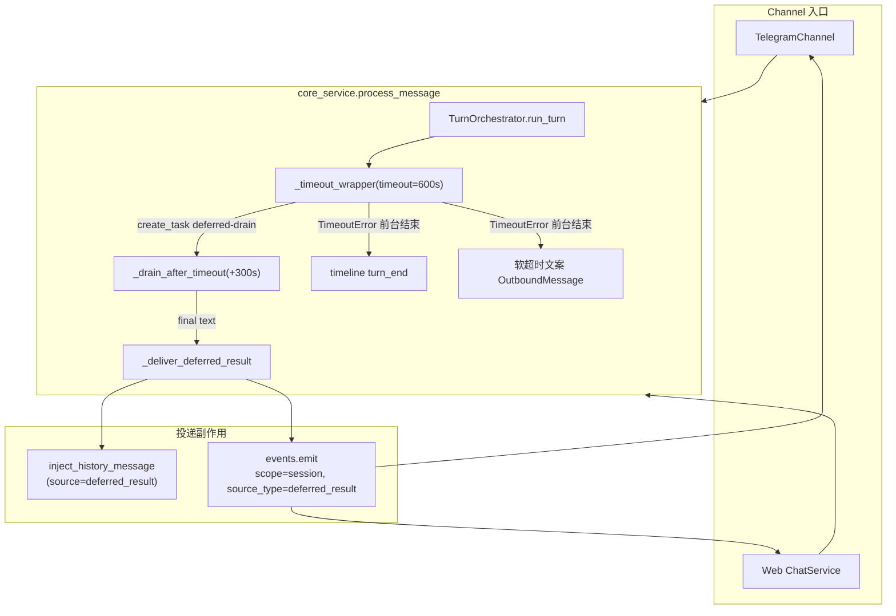
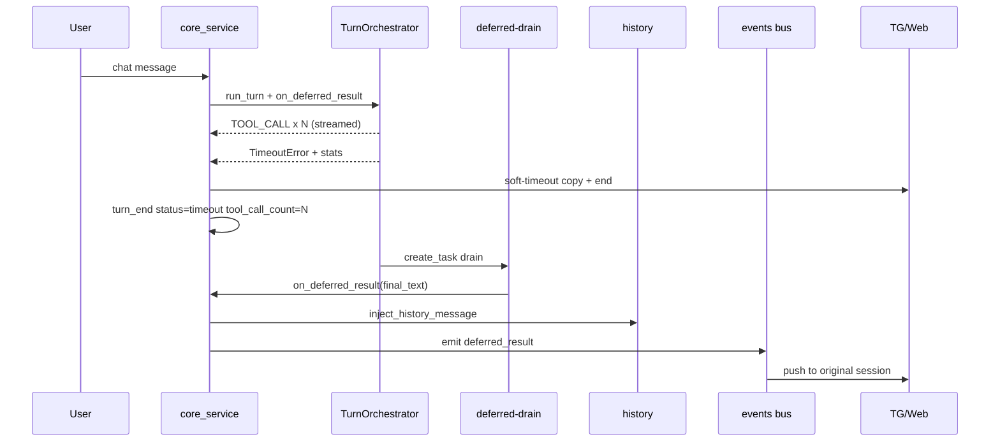

# 【channel/runtime】chat 软超时与 deferred 结果投递可观测、可送达

- Issue: #168
- 状态: Approved (petri code-dev run-002)
- 最后更新: 2026-07-21

## 1. 背景

Chat turn 默认 **600s 软超时**（`CHAT_POLICY.timeout_seconds`）。超时后 `_timeout_wrapper` 会拉起后台 **deferred-drain**（默认再约 **300s**，`drain_extra_seconds`），期望任务完成后通过 `_deliver_deferred_result` **双路投递**：写入原会话 history + `events.emit(source_type=deferred_result)` 实时推送。

现状与痛点（对齐 issue 案例 run `7cb2fb03-…`）：

1. **语义不清**：超时气泡易被理解为硬失败，用户不确定「是否仍在跑 / 是否还会推送」。
2. **投递不可靠可感**：路径已存在，但 Web 侧 idle gate 未放行 `deferred_result`，且缺稳定 e2e/集成验收，难保证 drain 窗口内终稿一定到达原会话。
3. **统计不一致**：timeout 的 `turn_end.tool_call_count` 曾为 `0`，与 Telegram「N commands executed」、milkie `tool.responded` 不一致，妨碍排查。

代码锚点（实现入口，非新模块）：

| 层 | 路径 |
|----|------|
| 超时/drain | `src/everbot/core/runtime/turn_orchestrator.py`（`_timeout_wrapper` / `_drain_after_timeout`） |
| 文案 + deferred 双路 | `src/everbot/core/channel/core_service.py`（timeout 文案、`_deliver_deferred_result`） |
| Policy | `src/everbot/core/runtime/turn_policy.py`（`timeout_seconds=600`, `drain_extra_seconds=300`） |
| TG 推送 | `src/everbot/channels/telegram_channel.py`（`deferred_result` 已 exempt 活跃闸） |
| Web 推送 | `src/everbot/web/services/chat_service.py`（`_on_background_event`） |
| History | `src/everbot/core/session/session_mailbox.py`（`inject_history_message` + run_id 去重） |

## 2. 设计目标与非目标

### 目标

- **S1**：软超时用户文案明确「后台仍继续」+「稍后可能自动推送」，与硬失败文案可区分。
- **S2**：drain 窗口内产生的最终文本稳定投递到**原 channel 会话**并进入 **history**；至少 1 条可重复的 e2e/集成路径验收。
- **S3**：同一超时 turn 上，渠道 commands 数、timeline `turn_end.tool_call_count`、milkie `tool.responded` 对齐（或文档写明可解释差值）。

### 非目标

- 仅靠把默认 600s 调大作为唯一手段。
- 长任务全面迁 job/workflow 的产品化重构。
- 本 issue 不吞并 #164 / #165 / #167 / #166。
- 不把默认 drain 窗口时长调整作为主交付（保持 300s 默认；配置项已存在，无需新配置面）。
- 不引入二次「drain 仍失败」用户提示产品化（见边界：仅日志 + 可观测；可另开）。
- 不改 Telegram/Web 以外的新渠道适配。

## 3. 架构设计

### 3.1 逻辑分层（现有路径加固，不新建子系统）



### 3.2 核心业务流程

**前台（用户可见超时）**

1. `TurnOrchestrator._run_attempt` 用 `_timeout_wrapper` 消费 agent 事件流。
2. 到达 deadline → 启动 `deferred-drain` 后台 task → 抛出 `asyncio.TimeoutError`。
3. **加固点 A**：在 `_run_attempt` 内捕获 TimeoutError，yield `TURN_ERROR`（或专用语义）时**带上已累计的** `tool_call_count` / `tool_names_executed` / `failed_tool_outputs`；`error` 字符串保留 `timeout` 关键字供 core_service 分支识别。
4. `core_service`：
   - 记录 `turn_end`，`status="timeout"`（与硬 `error` 区分），`tool_call_count` 取编排层与本地计数的可靠值（见 §5）。
   - 发送软超时文案（S1）+ `end`；**不**把软超时当硬失败堆栈气泡。
5. 释放 session 锁；drain 在锁外继续。

**后台（deferred 终稿）**

1. `_drain_after_timeout` 继续消费 aiter（至多 `drain_extra_seconds`），优先 LLM final text，否则 tool output 拼接。
2. 非空结果调用 `on_deferred_result(result_text)` → `_deliver_deferred_result`：
   - **(A)** `inject_history_message`（`metadata.source=deferred_result`, `run_id` 去重）。
   - **(B)** `events.emit(..., scope=session, target_session_id, target_channel, source_type=deferred_result)`。
3. **加固点 B（Web）**：`deferred_result` 加入 Web idle-gate bypass，避免超时后 20s 内被丢弃。
4. Telegram 已对 `deferred_result` 免除「用户活跃时 defer」闸；保持只投递 originating chat。
5. 空结果 / drain 异常：打英文 warning 日志，不伪造成功；不向用户发硬失败文案。



## 4. 组件与公共接口

### 4.1 `TurnOrchestrator` / `_timeout_wrapper` / `_drain_after_timeout`

| 职责 | 接口约定 |
|------|----------|
| 软超时 | 超时后 **不** `aclose` 前台 iterator（交给 drain）；无 drain 回调时才 aclose |
| 超时事件 | `_run_attempt` 捕获 `TimeoutError`，yield `TurnEvent(TURN_ERROR, error=..., tool_call_count=..., tool_names_executed=..., failed_tool_outputs=...)`，**禁止**在 `run_turn` 外层 bare `TURN_ERROR` 丢掉统计 |
| drain 回调 | `on_deferred_result: Callable[[str], Awaitable\|None]`，单参数最终文本（与现实现一致；修正过时测试里双参数假设） |
| 空结果 | drain 结束无文本则 **不调用** 回调 |

不新增对外配置项；继续读 `TurnPolicy.timeout_seconds` / `drain_extra_seconds`。

### 4.2 `core_service.process_message`

| 路径 | 行为 |
|------|------|
| 软超时分支 | 匹配 error 中 `timeout`（保持现有启发式，优先识别 orchestrator 超时消息）；文案见 §5 |
| `turn_end` | `status="timeout"`；`tool_call_count` 优先 `te.tool_call_count`，若为 0 且本地已累加则用本地值；可选写入 `deferred_drain=true` 元数据便于排查 |
| `_deliver_deferred_result` | 保持双路；失败只 log；history 前缀保留「超时后台任务完成后自动生成」语义 |
| 硬失败 | 既有「未能完成处理」路径不变；**不得**与软超时共用文案 |

### 4.3 Channel 投递

| Channel | 变更 |
|---------|------|
| Telegram | 文案走 core_service `text` 事件；commands 摘要逻辑不变（计 `skill` processing）。deferred 路由已正确 → **基本无改**，补回归测试 |
| Web | **`deferred_result` 加入 `bypass_idle_gate`**；session-scope 推到 `target_session_id`；无连接时允许仅 history 可达（实时推送 best-effort） |

### 4.4 不新增模块

不引入新 service / 新队列 / 新 DB。所有改动落在现有 turn 编排与 channel 投递边界内。

## 5. 数据与文案约定

### 5.1 超时文案（S1）

统一语义模板（TG/Web 同源字符串，渠道不各自发明语义）：

```
本轮前台等待已超时，后台任务仍在继续执行。
若在后续处理窗口内完成，我会自动把结果推送到本会话（并写入历史，可供后续引用）。
你无需重复发送同一指令；若长时间未收到结果，可再追问或换更具体的指令。
```

判定标准（可测）：

- 含「后台…继续」类语义；
- 含「自动推送 / 推送到本会话」类语义；
- **不含**硬失败句式「未能完成处理」「执行失败」作为主结论。

实现上可抽常量（如 `SOFT_TIMEOUT_USER_MESSAGE`）避免散落魔法字符串。

### 5.2 Deferred history 消息

保持现有结构：

```python
{
  "role": "assistant",
  "content": "[此消息由超时后台任务完成后自动生成]\n\n" + result_text,
  "metadata": {
    "source": "deferred_result",
    "run_id": run_id,  # 与 turn 的 chat_* run_id 一致，用于去重
    "injected_at": "<iso8601>",
  },
}
```

### 5.3 Event envelope

```python
events.emit(
  session_id,
  {"detail": result_text, "source_type": "deferred_result", "run_id": run_id, "agent_name": ..., "deliver": True},
  scope="session",
  target_session_id=session_id,
  target_channel=extract_channel_type(session_id),
  source_type="deferred_result",
  run_id=run_id,
)
```

### 5.4 Timeline `turn_end`（S3）

| 字段 | 软超时取值 |
|------|------------|
| `status` | `"timeout"`（新增区分；旧 `"error"+timeout 文案` 视为兼容，测试以新值为准） |
| `tool_call_count` | 与本 turn 已 yield 的 `TOOL_CALL`（及 skill_fallback tool_call）次数一致 |
| `tool_names_executed` | 非空时与执行序列一致 |
| `error` | 可保留 timeout 描述字符串 |

**计数对齐定义（本 issue 事实源）**：

- **N** = 本 turn 编排层计入的工具调用次数（与 milkie `tool.responded` 同 turn 对齐的目标值；内部 resource tools `_load_resource_skill` / `_read_skill_asset` 已在渠道侧隐藏且不应计入用户可见 N）。
- Telegram `commands executed` = 收到的 `skill` + processing 次数（已隐藏内部 tools）→ 应等于 N。
- `turn_end.tool_call_count` = N。
- 若 milkie 侧仍含框架内部 tool，文档一句说明：**用户可见 N 以 alfred 过滤后计数为准**；验收对比时对 milkie 做同名过滤或使用同 turn 的 alfred timeline `tool_call` 事件数作为中间真值。

### 5.5 根因（S3）— 实现必须修

`run_turn` 外层：

```python
except Exception as exc:
    yield TurnEvent(type=TURN_ERROR, error=str(exc))  # 丢失 tool_call_count
```

当 `_timeout_wrapper` 在 `_run_attempt` 内抛 `TimeoutError` 时，**已累计统计留在 `_run_attempt` 栈帧**，外层无法恢复。若 core_service 本地计数因事件映射缺口未同步，则 `turn_end.tool_call_count` 可能为 0。

**修复**：在 `_run_attempt` 对 timeout 特化捕获并带统计 yield；`run_turn` 仅作兜底。`core_service` 在 `TURN_ERROR` 时写回本地计数：`tool_call_count = te.tool_call_count or tool_call_count`（已有），并确保 timeline 使用更新后的值。

## 6. 设计思路与折衷

| 候选 | 决策 | 理由 |
|------|------|------|
| A. 仅加大 timeout | **不做**（非目标） | 不解决投递与统计；掩盖问题 |
| B. 现有 soft-timeout + drain + 双路加固 | **采用** | 路径已存在；改动面最小；满足 S1–S3 |
| C. 超时后转 job/workflow | **不做**（非目标） | 产品化面过大 |
| 文案渠道差异化 | **同源语义，单字符串** | 降低测试矩阵；展示层可加前缀但不改语义 |
| drain 失败二次提示 | **本期不做** | issue 未要求；避免新状态机 |
| 超时后用户又发新 turn | **仍投递原 session** + history 占位规则（已有） | 结果归属 originating turn；不静默丢弃 |
| Web idle gate | **bypass deferred_result** | 用户刚超时必然活跃；20s 闸会吞掉 +32s 案例中的终稿推送 |
| 新 status=`timeout` | **采用** | 可观测；比从 error 字符串反推清晰 |

## 7. 边界考虑

| 场景 | 行为 |
|------|------|
| drain 窗口内完成 | 推送 + history；run_id 去重防双写 |
| drain 超时仍无文本 | 不回调；仅日志；用户保留软超时文案，无伪造成功 |
| drain 中途异常 | log warning；aclose aiter；不抛到事件环 |
| 用户超时时已有部分 delta | 已展示内容保留；超时文案追加；deferred 终稿再推一条 |
| 用户在 drain 完成前发新消息 | deferred 仍进原 session history/push；role 交替由 `inject_history_message` 占位处理 |
| Web 无活跃 WS | history 仍写入；重连后可读 history（实时推送 best-effort） |
| TG 投递失败 | 现有 warning；history 仍是 LLM 后续引用真源 |
| 硬取消 `CancelledError` | 不走 deferred-drain 成功路径（保持现有 cancel 语义） |
| 并发 process_message | session 锁保证 turn 串行；drain 用 `update_atomic` 注入 history |

## 8. 测试计划

### 8.1 TDD 优先顺序（喂 `unit_test` / 开发）

1. **Unit — 超时统计（S3）**  
   - 脚本化 agent：先 yield N 次 tool_call/output，再 hang。  
   - `TurnOrchestrator` + 短 `timeout_seconds`。  
   - **Pass**：收到 `TURN_ERROR` 且 `tool_call_count == N`，`error` 含 timeout。  
   - **Pass**：`core_service`（mock session）`turn_end` 的 `tool_call_count == N` 且 `status == "timeout"`。

2. **Unit — 软超时文案（S1）**  
   - 触发 timeout 路径。  
   - **Pass**：outbound `text` 匹配 §5.1 语义（关键字断言，非整句锁死若需 i18n 弹性）。  
   - **Pass**：不出现硬失败主文案。

3. **Unit — drain 回调与双路（S2）**  
   - `_timeout_wrapper` / `_drain_after_timeout`：hang 后继续产出 LLM answer → 回调收到终稿。  
   - `core_service._deliver_deferred_result`：`inject_history_message` 被调用 + `events.emit` 带 `scope/target_*/source_type=deferred_result`。  
   - **Pass**：history content 含终稿与 deferred 前缀；emit 路由字段正确。

4. **Unit — Web idle gate（S2）**  
   - 模拟 `last_activity` 在 20s 内 + `source_type=deferred_result`。  
   - **Pass**：WS 仍收到推送（bypass 生效）。

5. **Unit — Telegram 回归**  
   - `deferred_result` 只到 originating chat；不因 active turn 被 defer（现有测试保持绿）。

### 8.2 Integration / E2E（S2 验收最低条）

**至少 1 条**集成路径（推荐 mock channel + 真实 `process_message` + 短 timeout policy，不必真 Telegram）：

| 步骤 | 期望 |
|------|------|
| 1. 配置 `timeout_seconds` 很小（如 0.3s）、`drain_extra_seconds` 足够（如 2s） | policy 生效 |
| 2. agent 流：tool × N → sleep → 最终 LLM text | 模拟案例 +32s 缩短版 |
| 3. 用户侧只发一条消息，等待 | 先收到软超时文案 |
| 4. 再等待 drain | 收到 deferred 终稿（event 或 channel sink） |
| 5. 读 session history | 存在 `metadata.source==deferred_result` 且 content 含终稿 |
| 6. 读 timeline | `turn_end.tool_call_count == N`，`status==timeout` |

**Pass 标准**：步骤 3–6 稳定可重复（CI 绿）。

### 8.3 与 Stories 映射

| ID | 测试层 |
|----|--------|
| S1 | Unit 文案断言 |
| S2 | Unit drain+emit + Integration/E2E 一条路径 |
| S3 | Unit orchestrator/core_service 统计 + Integration timeline 字段 |

## 9. Acceptance checklist

交付边界：仅 chat 软超时语义、deferred 投递加固、timeout turn 统计、最小 e2e/集成验证。  
评审须在 `review.json` 中逐条报告下列 ID。

| ID | 可观察通过条件 |
|----|----------------|
| **S1** | 软超时且 drain 仍进行时，用户可见文案明确表达「后台仍继续」与「可能自动推送到本会话」；不与硬失败主文案混淆。 |
| **S2** | 至少 1 条 e2e/集成测试稳定复现：超时后 drain 窗口内终稿 → 原会话收到 deferred_result（或等价推送）→ history 可查且可供后续 turn 引用。 |
| **S3** | 同一超时 turn，当编排层工具调用为 N 时，渠道 commands 展示与 timeline `turn_end.tool_call_count` 均为 N；若与 milkie 原始计数存在过滤差值，usage/注释中有可解释说明。 |
| **NG1** | 未将「默认 600s 调大」作为唯一交付手段。 |
| **NG2** | 未做长任务 job/workflow 产品化重构；未吞并 #164/#165/#167/#166。 |

## 10. 实现顺序（给开发）

1. **S3**：`_run_attempt` 捕获 timeout + 带统计 `TURN_ERROR`；`core_service` `turn_end status=timeout` 与计数回写。单测先红后绿。  
2. **S1**：抽换软超时文案常量 + 单测。  
3. **S2**：Web `bypass_idle_gate` 含 `deferred_result`；补 drain→deliver 单测；补 1 条 integration。  
4. 回归：既有 `test_timeout_wrapper_*`、`test_deferred_result_*`、telegram deferred 测试。  
5. （可选）`docs/runtime_design.md` Flow ④ 补一句 Web bypass 与 `status=timeout`，避免与代码漂移。

## 11. 开放问题 / 已拍板

| # | 问题 | 本设计拍板 |
|---|------|------------|
| 1 | 文案渠道差异化？ | **否**，同源语义字符串 |
| 2 | drain 失败二次提示？ | **本期不做**，仅日志 |
| 3 | 新消息竞态？ | **仍投递原会话**；history 占位已有 |
| 4 | `tool_call_count=0` 边界？ | **优先修 timeout 路径**；不扩大到所有提前结束除非同根因 |
| 5 | 真 Telegram e2e？ | **不强制**；mock channel + integration 满足 S2 |

## 12. 关联

- Issue: https://github.com/xforce-io/alfred/issues/168
- 同批：#164 → #165 → **#168** → #167 → #166
- 案例：milkie run `7cb2fb03-b3dc-4e09-be27-d5739abbc31a`，session `tg_session_demo_agent__8576399597`
- 既有设计叙述：`docs/runtime_design.md` §7.5 Flow ④ deferred_result 双路投递
- 既有测试：`tests/unit/test_turn_orchestrator.py`、`test_channel_core_service.py`、`test_telegram_channel.py`、`test_session_manager_core.py`
