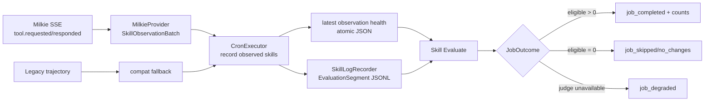
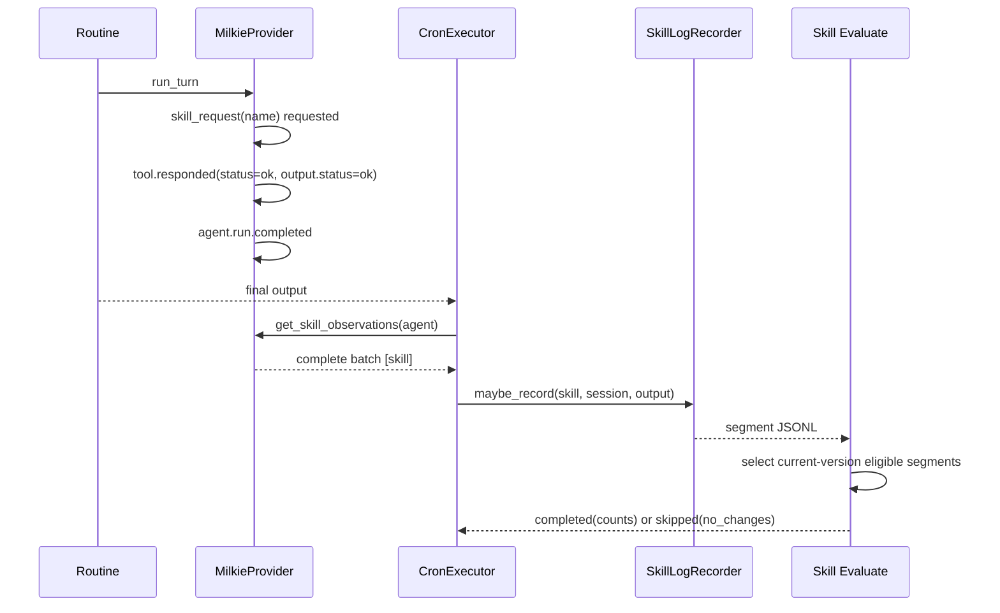

# 【SLM】恢复 Milkie 技能评估观测并消除空跑假成功

- Issue: #187
- 状态: Approved
- 最后更新: 2026-08-02

## 1. 背景

生产 routine 已切换到 Milkie，但 routine 完成后的 SLM 记录仍从 Dolphin 时代的 trajectory 中查找 `_load_resource_skill`。`MilkieProvider.init_trajectory()` 是 no-op，因此新 routine 即使真实调用 `skill_request`，也不会产生新的 `EvaluationSegment`。另一方面，Skill Evaluate 在没有日志或当前版本没有新增样本时返回 `None`，cron 将其记录为 `job_completed`，造成“任务成功”与“评估过新样本”无法区分。现场数据中 Milkie run 持续到 2026-08-02，而 routine trajectory、生产技能有效样本和评估报告均停在 2026-06-03—04。概要设计见 Issue #187 的 Approved 评论。

## 2. 名词解释

| 术语 | 含义 |
|------|------|
| canonical observation | provider 将私有事件归一化后的技能加载事实，包含技能名及观测完整性，不暴露底层事件存储格式 |
| complete observation | provider 看到了本轮正常终态，能判定技能集合为空或非空 |
| no changes | 观测链路正常，但当前版本没有尚未覆盖的新评估样本 |
| observation unavailable | provider 未提供技能观测能力，或本轮事件流缺少可判定终态；不得解释为“没有调用技能” |
| eligible segment | 属于当前技能版本、包含上下文或输出、且尚未被现有报告覆盖的样本 |

## 3. 设计目标与非目标

- **目标**：Milkie routine 的成功技能加载在不生成 legacy trajectory 的情况下落为可追踪样本。
- **目标**：同一 session 内同一 skill/version 幂等，只形成一条 routine 级评估样本。
- **目标**：Skill Evaluate 终态明确区分 evaluated、no changes 与 LLM unavailable，并携带 observed/eligible/evaluated 计数。
- **目标**：真实 Milkie sidecar E2E 覆盖“技能请求 → 样本 → 评估报告 → 再次执行 no changes”。
- **非目标**：回填 2026-06-04 之后已经丢失的历史调用。
- **非目标**：改变 Judge 算法、版本晋升/回滚阈值或技能业务输出。
- **非目标**：要求 provider 复制 Milkie event store 为 Dolphin trajectory。

## 4. 能力与功能设计

routine 成功结束后，cron 从当前 agent 对应 provider 读取本轮 `SkillObservationBatch`。批次完整且包含技能时，按唯一技能名调用现有 `SkillLogRecorder`；完整且为空时不写样本，但保留“观测成功、零技能”的可判定语义；不完整时写结构化 `skill_observation_unavailable` 事件，并把最新观测健康状态原子写入 skill logs 目录，不把它当作零技能。下一轮完整观测会覆盖该状态，使链路自动恢复。

Skill Evaluate 返回内部结构化 `JobOutcome`：

- `completed`：至少一个 eligible segment 被纳入新报告；事件带计数。
- `skipped/no_changes`：观测日志存在但没有尚未覆盖的 eligible segment，或日志目录为空；不再写 `job_completed`。
- `degraded/llm_unavailable`：存在 eligible segment，但 Judge 暂时不可用；保留现有重试语义。
- `degraded/observation_unavailable`：最新 provider 观测批次不完整；即使没有新 JSONL，也不得降级成 no changes。

### 4.1 UI / UX

N/A — 无新页面。运维通过 heartbeat JSONL/job 事件读取稳定状态和计数。

## 5. 设计思路与折衷

选择在 `AgentProvider` 边界增加只读的技能观测批次，而不是让 SLM 解析 Milkie JSONL/SQLite。Milkie 在 `run_turn` 内已看到原生 `tool.requested` / `tool.responded`，可以在成功的 `skill_request` 响应处记录被加载的技能；cron 只消费 provider 中立结果。该方案保持事件事实源唯一，也允许未来 provider 自行映射私有事件。

Milkie 只把 `skill_request` 工具结果中 `status=ok` 的请求视为技能加载成功；not_found/unavailable 不形成技能样本。重复加载在 provider 批次和 cron 记录两层去重。事件流必须看到成功的 `agent.run.completed` 才标记 batch complete；异常终止沿原任务失败路径处理。

保留 trajectory 解析作为无观测方法的兼容回退，但不作为 Milkie 主路径。放弃从任务描述、prompt 或 manifest 推断技能，因为这些信息只说明意图/可用性，不能证明真实调用。放弃仅增加 warning，因为它不能恢复样本，也不能修正假成功终态。

## 6. 架构设计

### 6.1 逻辑分层



### 6.2 核心业务流程



失败路径：Milkie run 抛错时 routine 保持既有 failed/retry 行为，不记录 completed 样本；provider 不支持观测且没有可用 trajectory 时，cron 发出 observation unavailable 事件；Judge 超时继续转换为可重试 degraded。

## 7. 模块设计

| 模块 | 契约变化 |
|------|----------|
| `core/agent/provider/base.py` | 新增 `SkillObservationBatch` 数据契约与 `get_skill_observations(agent)` 可选能力 |
| `core/agent/provider/milkie/provider.py` | 在 handle 内维护当前 turn 的 pending skill requests、成功加载集合和 complete 标志 |
| `core/runtime/cron.py` | routine 完成后优先读取 provider observation；仅在能力缺失时回退 trajectory；落盘结果返回计数并记录不可用事件 |
| `core/slm/segment_logger.py` | 原子保存/读取最新观测健康状态，使评估任务能区分零样本与观测中断 |
| `core/slm/skill_log_recorder.py` | 暴露不影响主任务的观测状态写入适配器 |
| `core/jobs/result.py` | 定义 provider-neutral job outcome：completed/skipped/degraded 及结构化 detail |
| `core/jobs/skill_evaluate.py` | 统计 observed/eligible/evaluated segments，零变化返回 skipped outcome |
| `core/runtime/cron.py::_invoke_job` | 将 JobOutcome 映射为准确的 heartbeat 事件，不再把所有正常返回统一写作 completed |

观测批次不持久化工具参数和完整 skill instructions，只保留去重后的技能名、完整性和稳定原因码。技能版本继续由 `SkillLogRecorder` 从真实 `SKILL.md` 解析，避免 provider 与 SLM version manager 重复实现版本选择。

## 8. API / CLI 设计

`AgentProvider` 新增可选同步读取能力：

```python
@dataclass(frozen=True)
class SkillObservationBatch:
    skill_names: tuple[str, ...]
    complete: bool
    reason: str = ""

def get_skill_observations(self, agent: Any) -> SkillObservationBatch: ...
```

job 内部返回契约：

```python
@dataclass(frozen=True)
class JobOutcome:
    status: Literal["completed", "skipped", "degraded"]
    reason: str
    summary: str = ""
    detail: dict[str, Any] = field(default_factory=dict)
```

heartbeat 事件字段保持向后兼容，并新增：`observed_count`、`eligible_count`、`evaluated_count`、`reason`。既有返回字符串的 job 仍走原路径。

## 9. 边界考虑

- `skill_request` hit 与 miss 必须通过 tool result 区分，miss 不计入样本。
- 同一技能重复请求、SSE 重放和 routine 重试不得在同一 session 形成重复 segment。
- provider handle 每个 turn 开始前清空临时观测，避免前一轮污染后一轮。
- 无 terminal、JSON 异常或能力缺失不能被解释为“零技能”；损坏的观测状态文件按 unavailable 处理。
- 失败技能调用可以在未来扩展为 failed segment；本 issue 只记录成功加载后产生的 routine 最终输出，保持现有评估语义。
- 不记录密钥、工具原始参数或完整 instructions；输出继续受现有 4 KiB inline / artifact 规则保护。
- 并发 sidecar handle 相互隔离；单 handle 当前只允许其既有 turn 生命周期内读取本轮批次。

## 10. 迁移 / 兼容 / 回滚

无需数据迁移。旧 JSONL 和 eval report 格式不变；新增 `.observation_state.json` 只保存最新健康状态，不存在时兼容既有目录。Milkie 使用新 provider observation；缺少新方法的测试替身/旧 provider 使用 trajectory 兼容回退。回滚时可忽略该状态文件并删除新 provider 方法和 JobOutcome 映射，但会重新出现 #187 的观测断链，因此生产回滚必须同步告警。

## 11. 测试计划

- **E2E**：使用现有 fake OpenAI + 真实 `milkie serve`，强制 `skill_request` hit；不创建 trajectory。断言 provider batch complete、技能名准确、SkillLogRecorder 生成唯一 segment；用确定性 Judge 执行真实 Skill Evaluate 文件管线，断言 eval report `segment_count=1`、job outcome completed 且计数为 1；第二次执行断言 skipped/no_changes。若本机无 Milkie dist，测试允许 skip，但交付验证必须在配置了 `MILKIE_CLI` 的环境实际跑通并记录命令输出。
- **Integration**：Milkie SSE hit/miss/重复/无 terminal；cron provider observation 优先级、trajectory fallback、unavailable event；观测健康状态到 degraded outcome；JobOutcome 到 completed/skipped/degraded 事件映射；segment 到报告的新增覆盖计数。
- **Unit**：skill name 参数解析、batch reset/dedupe、观测状态原子读写及损坏处理、JobOutcome 序列化、eligible 增量计数和零样本状态。

## 12. 开放问题 / 决策记录

- 2026-08-02：Approved L1 后选择 provider observation，不重建 trajectory。
- 2026-08-02：Milkie 成功加载以 `tool.responded.status=ok` 且结果 payload `status=ok` 为准；仅看到 request 不足以证明加载。
- 2026-08-02：历史缺口不回填，避免用 prompt/manifest 制造不可证明的样本。

## 13. 关联

- Issue #187
- 概要：Issue #187 Approved 设计评论
- PR：待创建
- `src/everbot/core/agent/provider/base.py`
- `src/everbot/core/agent/provider/milkie/provider.py`
- `src/everbot/core/runtime/cron.py`
- `src/everbot/core/jobs/skill_evaluate.py`
