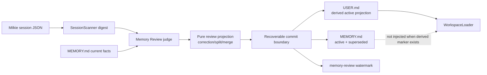
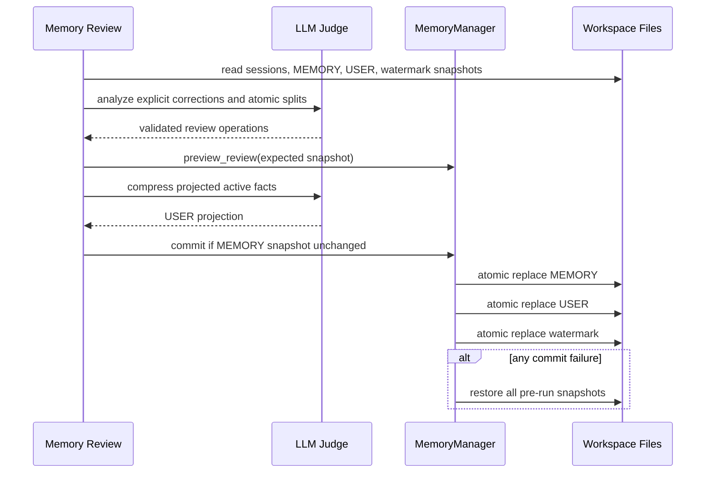

# 【memory】让用户纠正可靠取代陈旧画像

- Issue: #188
- 状态: Implemented
- 最后更新: 2026-08-02

## 1. 背景

用户在 2026-07-29 明确说明“不再负责 kweaver-core”，但 2026-08-01 的 MEMORY.md 与长期未刷新的 USER.md 仍保留相反画像。现有 Memory Review 只允许合并、降权、强化和原地改写既有记录，无法表达“新事实取代旧事实”或把一条混合记录拆成独立事实；score 低于 0.5 时又直接保留旧 USER.md。Milkie 会话结束路径还跳过 profile extraction，因此纠正只能依赖后续 review 从 session digest 中识别。最后，WorkspaceLoader 同时注入 USER.md 和原始 MEMORY.md，即使旧条目已归档，也可能再次污染下一会话。概要设计见 Issue #188 的 Approved 评论。

## 2. 名词解释

| 术语 | 含义 |
|------|------|
| 原子画像事实 | 可独立评分、失效和投影的一项长期用户事实，不混入临时任务或故障日志 |
| correction | 用户在会话中明确否定或更新一项既有画像事实 |
| supersede | 新事实取代一个或多个冲突旧事实；旧事实保留溯源但不再 active |
| split | 将一条混合画像记录替换为多个原子长期事实；不合格的临时内容不进入新画像 |
| active projection | 从 active 且 score 达阈值的原子事实派生出的 USER.md |
| commit boundary | MEMORY、USER 与成功 watermark 要么全部更新，要么恢复到执行前状态 |

## 3. 设计目标与非目标

- **目标**：明确纠正不受普通相关性分数约束，在一次成功 review 内取代冲突旧事实。
- **目标**：旧事实保留 superseded 溯源，但不会进入 USER.md 或下一会话系统提示。
- **目标**：无 active 事实时原子写入中性 USER.md，不保留旧画像。
- **目标**：Memory Review 可把混合巨型记录拆成独立长期事实，并排除临时任务和故障日志。
- **目标**：LLM/解析/文件写入/watermark 失败时不产生半更新，原输入可重试。
- **非目标**：从用户未明确表达的内容推断新身份或删除事实。
- **非目标**：恢复所有历史会话、重写事件记忆或改变通用模型供应商。
- **非目标**：把 USER.md 变成新的事实源；它始终是 MEMORY 的可重建投影。

## 4. 能力与功能设计

Memory Review 将最近 session digest 与完整的现有画像条目交给 consolidation judge。输出在既有 merge/deprecate/reinforce/refine 之外增加两类受约束操作：

- `corrections`：包含纠正后的原子事实与被取代的 active entry IDs。只有 digest 中可定位的用户明确表述才允许生成；至少命中一个既有 active ID 才应用。
- `split_entries`：指定一个 active 混合条目及 1—8 个长期原子事实。原条目变为 superseded；临时任务、一次性状态和故障日志不得出现在 children 中。

每个新原子条目有稳定 ID、来源 session、active 状态和 `supersedes` 关系；旧条目标记 `superseded` 与 `superseded_by`。重复处理同一纠正或 split 时，已 superseded 的源不再二次应用。

USER.md 每次成功 review 都由 active、score ≥ 0.5 的事实重建。active 为空时写入固定中性投影，结果为 `profile_cleared`；非空时写入带派生标记的压缩投影，结果为 `profile_rebuilt`。WorkspaceLoader 识别该标记后不再把原始 MEMORY.md 注入系统提示，避免 archived/superseded 内容绕过投影门禁。

### 4.1 UI / UX

N/A — 无页面。job completed 结果明确包含 `profile_cleared` 或 `profile_rebuilt:N`；连接、超时、解析或提交异常沿既有 job degraded/failed 事件暴露。

## 5. 设计思路与折衷

选择扩展现有 MEMORY.md 条目元数据，而不是引入数据库或第二套事实仓库。现有条目 ID、分数、来源和 Markdown 运维可读性得以保留，旧格式可无损按 active 读取。superseded 条目仍留在 Archived Memories，提供最小可追踪关系。

选择由 review 从 Milkie 已落盘 session digest 识别 correction，而不是等待会话结束 extraction bridge。这样直接修复当前生产路径，且 watermark 天然提供失败重试输入。未来补齐 Milkie session-end extraction 后，两者仍可通过 stable relation 与幂等门禁共存。

选择先完成两次 LLM 计算，再进入短提交临界区；提交前校验 MEMORY 快照未并发变化，提交中原子替换 MEMORY、USER、watermark，任一步失败则用执行前快照恢复。放弃“先改 MEMORY 再调用压缩 LLM”，因为压缩超时会留下半更新。放弃仅降低 0.5 阈值，因为会重新注入低质量巨型记录且无法表达冲突。

选择 USER.md 作为会话画像唯一投影。放弃继续同时注入原始 MEMORY.md，因为后者必须保留 superseded 溯源，两者同时注入会破坏失效语义。

## 6. 架构设计

### 6.1 逻辑分层



### 6.2 核心业务流程



失败路径：consolidation 或 compression 连接错误、超时、配置错误、JSON 解析失败均在提交前终止；并发 MEMORY 变化使本轮失败并保留 watermark；文件替换失败触发三文件回滚。下一次成功 review 使用同一 watermark 重新读取纠正。

## 7. 模块设计

| 模块 | 契约变化 |
|------|----------|
| `core/memory/models.py` | `MemoryEntry` 增加 active/superseded 状态与双向取代关系 |
| `core/memory/profile_store.py` | 保持旧 header，兼容读取可选关系 metadata comment 并使用原子替换；active 选择排除 superseded |
| `core/memory/manager.py` | 纯 review projection、correction/split 校验与幂等应用、快照一致性提交 |
| `core/jobs/memory_review.py` | 从 digest 生成 correction/split，先预览和压缩再提交，返回可观察 profile 结果 |
| `core/jobs/system_dphs/memory_review_consolidation.dph` | 约束明确纠正、原子 split 与临时内容排除 |
| `infra/workspace.py` | 派生 USER.md 存在时只注入 USER 投影，不再注入原始 MEMORY |
| `core/scanners/reflection_state.py` | 保存失败可被调用方检测，避免伪推进 watermark |

## 8. API / CLI 设计

无公共 API/CLI。内部 review JSON 增量契约：

```json
{
  "corrections": [{
    "content": "用户现在不负责项目 A",
    "category": "fact",
    "supersedes_ids": ["old123"],
    "source_session": "session-id"
  }],
  "split_entries": [{
    "id": "giant1",
    "entries": [
      {"content": "用户偏好简洁输出", "category": "preference", "importance": "high"}
    ]
  }]
}
```

旧的 merge/deprecate/reinforce/refined 字段继续兼容。未知 ID、空 correction、无明确 supersedes、对已 superseded 源的重复操作均跳过并记录 warning。

## 9. 边界考虑

- correction 必须引用 digest 中用户明确说法和至少一个冲突 active ID；助手承诺或模型推断不能单独触发删除。
- 纠正新事实初始 score 固定为高优先级，不受被纠正巨型记录的低分影响。
- split 每个 child 必须非空、类别合法、数量有界；一次性任务/故障默认丢弃而不是迁入 profile。
- 旧格式没有状态字段时按 active 读取；损坏关系元数据不影响其他条目加载。
- superseded 内容保留在 MEMORY 但不进入 prompt、profile compression 或 prompt recall。
- USER 内容和模型输出有长度上限；空画像使用固定文本，不调用 compression LLM。
- 文件不保存密钥；失败日志只含稳定原因与 entry/session ID。
- 提交锁覆盖 MEMORY/USER/watermark 快照校验和替换；同一 correction 重放必须幂等。

## 10. 迁移 / 兼容 / 回滚

首次成功写 MEMORY 时，旧 header 下方自动补可选关系 metadata comment；没有 metadata 的条目按 active 读取，无需一次性批处理。现有巨型记录只在 judge 明确输出 split/correction 时迁移，旧条目保留为 superseded。旧 USER.md 在首次成功 review 时被原子重建；没有 active 事实则写中性投影。

回滚代码后，旧 parser 仍能按原 header 读取条目，关系 metadata comment 只会成为无害的附加文本；若需恢复旧失效语义则使用 `MEMORY.md.bak`。USER.md 的派生标记也是 HTML comment，旧 WorkspaceLoader 可安全注入。watermark 格式不变。

## 11. 测试计划

- **E2E**：用真实 session JSON 与 WorkspaceLoader 构造旧 MEMORY/USER，用户消息明确“我现在不负责项目 A”；确定性 judge 输出 correction。运行完整 Memory Review 后断言旧 entry 为 superseded、新 entry 关联来源、USER 不含仍负责表述；重新构建下一会话 system prompt 并用确定性回答器验证答案不是“仍负责”。同一 fixture 再运行一次断言幂等。第二条 E2E 构造全低分/失效事实，断言 USER 被清为中性投影且 MEMORY 不被注入。
- **Integration**：在 consolidation、compression、MEMORY replace、USER replace、watermark replace 注入连接错误/超时/写失败，断言三个文件和 watermark 均保持执行前快照；恢复后一次成功执行收敛。提交前并发插入新事实应拒绝本轮而不丢数据。
- **Unit**：新旧 header round-trip；active/superseded 过滤；correction/split 校验与重复处理；混合巨型记录拆分；原子 USER 写与空投影；WorkspaceLoader 单一投影门禁。

## 12. 开放问题 / 决策记录

- 2026-08-02：Approved L1 后采用 MEMORY 事实源 + USER 派生投影，不以降低 score 阈值修复。
- 2026-08-02：Milkie correction 先由 review digest 路径处理；session-end extraction bridge 不阻塞本 issue。
- 2026-08-02：旧事实保留溯源但不注入；会话行为以新 WorkspaceLoader system prompt 为最终验收事实源。

## 13. 关联

- Issue #188
- 概要：Issue #188 Approved 设计评论
- PR：[GitHub #190](https://github.com/xforce-io/alfred/pull/190)
- `src/everbot/core/jobs/memory_review.py`
- `src/everbot/core/memory/`
- `src/everbot/infra/workspace.py`
