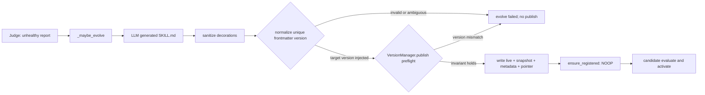
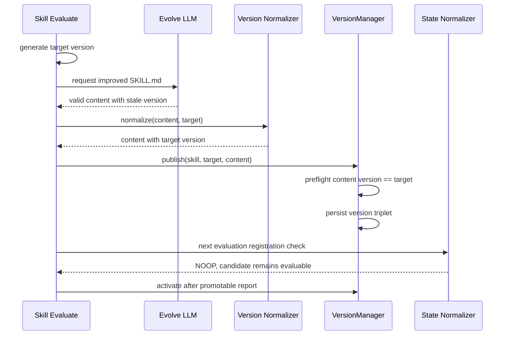

# 【SLM】保证 evolve 发布版本与技能 frontmatter 一致

- Issue: #191
- 状态: Approved
- 最后更新: 2026-08-02

## 1. 背景

SLM 在评估失败后生成系统目标版本 `new_version`，再让 LLM 返回完整 `SKILL.md`。现有链路只在 prompt 中要求 LLM 同步 frontmatter 版本，结构校验却只确认存在 `version:`；`VersionManager.publish()` 又把内容原样写入 live 文件和候选快照，同时用函数参数更新 pointer。当模型保留旧版本号时，三个版本标识立即分叉，下一轮 `ensure_registered()` 将其识别为 `CONFLICT_DETECTED`，候选无法继续评估或激活。该问题在扩展 #187 的完整 SLM lifecycle E2E 时被稳定复现。概要设计经用户于 2026-08-02 明确批准。

## 2. 名词解释

| 术语 | 含义 |
|------|------|
| target version | SLM 根据当前版本和时间生成、用于本次 evolve 发布的系统版本号 |
| content version | `SKILL.md` 首个 frontmatter 内唯一顶层 `version` 字段的值 |
| publish invariant | publish 开始任何写入前必须满足 `content version == target version` |
| version triplet | live `SKILL.md`、候选 snapshot 和 current pointer 中的三个版本标识 |

## 3. 设计目标与非目标

- **目标**：模型输出携带旧版本号时，由系统确定性改写为 target version，而不是发布冲突状态。
- **目标**：`VersionManager.publish()` 对所有调用方实施写前版本一致性保护。
- **目标**：非法或歧义 frontmatter 在任何 live、snapshot、metadata 或 pointer 写入前被拒绝。
- **目标**：完整 E2E 证明候选从 TESTING 进入 ACTIVE，随后无新增样本时返回 skipped/no_changes。
- **非目标**：改变 Judge、evolve 触发条件、连续 evolve 限制或激活阈值。
- **非目标**：修改模型生成的技能正文、name 或其它 frontmatter 字段。
- **非目标**：扫描或自动修复已存在的 `CONFLICT_DETECTED` 历史状态。

## 4. 能力与功能设计

evolve 仍要求 LLM 返回完整技能文件，但 target version 不再属于模型自由输出。模型结果完成现有装饰清洗后，系统只在首个合法 frontmatter 中定位唯一的顶层 `version` 行，并把其标量值替换成 target version；正文及其它字段保持原字节顺序和格式。缺少版本行、出现多个顶层版本行或 frontmatter 无法闭合时，结果不可安全规范化，evolve 返回失败且不调用 publish。

规范化后的内容进入 `VersionManager.publish()`。publish 独立解析 content version 并与参数 version 比较；缺失、歧义或不相等均在创建技能目录、写 live 文件或版本材料之前以 `ValueError` 拒绝。调用方规范化提升自动改进成功率，发布边界校验则保证未来 CLI、管理接口或测试调用方也不能绕过持久化不变量。

### 4.1 UI / UX

N/A — 无页面或用户交互变化。失败仍沿现有 evolve-failed 邮箱消息和日志呈现；本设计只消除可确定修复的旧版本号失败。

## 5. 设计思路与折衷

选择“调用方确定性规范化 + 发布边界写前验证”的双层方案。版本号由系统命名和状态机引用，本质上是控制面元数据，不应依赖概率模型正确复制。仅在 `_maybe_evolve` 校验相等会避免冲突，但会把一次可安全修正的漏改变成自动改进失败；仅在 `publish()` 内静默改写则会让底层存储层承担内容生成策略，并掩盖其它调用方传错版本。因此规范化属于 evolve 适配层，强制不变量属于 version manager。

放弃继续强化 prompt，因为提示词不能提供确定性契约。放弃引入 YAML 库重序列化整个 frontmatter，因为这可能改变引号、注释、键顺序和多行标量，扩大技能内容 diff。选择受限文本变换：只接受首个 frontmatter 中唯一、无缩进的 `version:` 行；正文中的同名文本和嵌套字段不参与判断。缺失或重复字段不自动猜测，直接拒绝。

## 6. 架构设计

### 6.1 逻辑分层

### 6.2 核心业务流程

失败路径在 normalizer 或 publish preflight 结束，不发生任何存储变更。既有 symlink-managed 检查继续拒绝可能覆盖上游的发布；其错误语义不变。

## 7. 模块设计

| 模块 | 契约 |
|------|------|
| `core/jobs/skill_evaluate.py` | 清洗 LLM 输出后，将首个 frontmatter 的唯一顶层版本字段规范化为 target version；无法安全规范化时不调用 publish |
| `core/slm/version_manager.py` | 提供一致的 frontmatter version 解析语义；`publish()` 在任何写操作前强制 content/target 相等 |
| `core/slm/state_normalizer.py` | 不改变；继续把人工篡改或历史不一致识别为 `CONFLICT_DETECTED`，作为下游防线 |
| lifecycle E2E | LLM stub 故意保留 baseline 版本，验证生产代码完成规范化并走通 activate |

frontmatter 解析只认可位于首个分隔块内、行首无空白的 `version:`。唯一性判断基于顶层候选行数量；值允许既有单引号、双引号或无引号格式，规范化输出统一为 `version: "{target}"`，不改其它行。

## 8. API / CLI 设计

无公共 API 或 CLI 变化。内部 Python 契约调整如下：

- evolve 版本规范化函数接收完整技能文本和 target version，成功返回规范化文本，非法/歧义输入返回不可发布结果。
- `_validate_skill_md` 支持校验 expected version，使调用方可以同时证明结构有效和版本正确。
- `VersionManager.publish(skill_id, version, skill_content)` 签名保持不变，但新增前置条件：content version 必须唯一且等于 `version`；违反时抛出 `ValueError`，且不得产生写入。

## 9. 边界考虑

- 版本字段中的 `#`、多行标量、空值或额外尾随内容不做猜测；无法得到唯一标量时拒绝。
- 正文代码块或示例中的 `version:` 不参与规范化和 publish 校验。
- target version 沿用现有系统生成格式，不接收 LLM 提供的替代值。
- publish preflight 位于 `mkdir`、live 写入、asset symlink、snapshot、metadata 和 pointer 写入之前，保证 S2 的零部分写入。
- 调用方仍须遵守既有 per-skill 文件锁；本设计不改变并发模型。
- symlink-managed 技能仍在写入前拒绝；版本检查与 symlink 检查均不得造成磁盘变化。
- 不新增依赖、不处理权限或多租户边界，也不记录任何凭证。

## 10. 迁移 / 兼容 / 回滚

无需数据迁移，版本目录和 pointer JSON 格式不变。所有现有合法 `publish()` 调用内容版本本就与参数一致，行为保持不变；依赖不一致内容被接受的调用会改为写前 `ValueError`，这是有意收紧。历史冲突不会自动修复，仍由现有诊断路径暴露。

回滚代码不会影响已发布的一致候选，但会重新允许未来不一致写入。若回滚，必须同时撤销 lifecycle 回归断言，并接受 #191 风险重新出现；不需要清理新数据格式。

## 11. 测试计划

- **E2E（S1/S3）**：LLM stub 返回结构合法但保持 baseline version；执行 baseline 三条失败样本 → Skill Evaluate 产生 TESTING candidate，断言 live、snapshot、pointer 都是 target version且注册为 NOOP；为 candidate 写入三条健康样本 → 再次评估并激活 ACTIVE；第三次执行断言 skipped/no_changes，整个流程无 `CONFLICT_DETECTED`。
- **Integration（S2）**：分别用缺少 frontmatter version、重复顶层 version 和 content/target 不一致直接调用 publish；断言抛出 `ValueError`，且 live 内容、已有 pointer、已有版本列表均保持调用前状态。
- **Unit（S1/S2）**：覆盖旧版本替换、单双引号/无引号、正文 `version:` 不误判、缺失字段、重复字段、未闭合 frontmatter、expected version 校验；覆盖 publish preflight 在首次发布和已有稳定版本两种状态下零写入拒绝。

## 12. 开放问题 / 决策记录

- 2026-08-02：用户明确批准 L1，选择系统维护 target version，不依赖 LLM 正确复制。
- 2026-08-02：选择受限文本规范化，不引入 YAML 重序列化依赖。
- 2026-08-02：publish 保持签名不变并新增写前不变量；历史冲突修复不在本 issue。

## 13. 关联

- Issue #191
- 概要设计：Issue #191 评论
- 发现来源：Issue #187
- 相关实现：PR #189
- `src/everbot/core/jobs/skill_evaluate.py`
- `src/everbot/core/slm/version_manager.py`
- `src/everbot/core/slm/state_normalizer.py`
