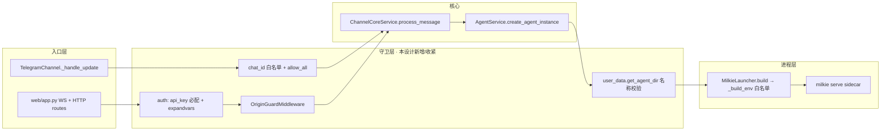

# 227 · 缺省拒绝：Telegram / Web 鉴权与 sidecar 环境白名单

- Issue: [#227](https://github.com/xforce-io/alfred/issues/227)
- L1: [issue comment](https://github.com/xforce-io/alfred/issues/227#issuecomment-5650054530)（Approved 2026-09-13）
- 状态：Approved
- 最后更新：2026-09-13

## 1 背景

四个入口在缺省配置下都是放行：Telegram `allowed_chat_ids` 未配置即接受任意 chat（`channels/telegram_channel.py:111-113,680`）；Web `api_key` 为空或读配置异常即放行（`web/auth.py:22-28,49-55`），WS 与 POST 无 Origin 校验；milkie sidecar 以 `dict(os.environ)` 继承 daemon 全部环境（`core/agent/provider/milkie/launcher.py:154`），而 `bin/everbot:7-13` 把 `~/.env.secrets` 全部注入 daemon；`get_agent_dir` 不校验名字（`infra/user_data.py:250-252`）。执行失败把 traceback 发到频道（`core/channel/core_service.py:690`）。线上配置未设 `allowed_chat_ids` 与 `web.api_key`。

## 2 名词解释

| 规范名 | 定义 |
|---|---|
| sidecar | daemon 为每个 agent 启动的 `milkie serve` Node 子进程；agent 的工具调用（含 `run_command`）都在其中执行。见 `docs/glossary.md`。 |
| env_passthrough | per-agent 配置项 `everbot.agents.<name>.env_passthrough`，列出允许从 daemon 环境透传到该 agent sidecar 的变量**名**。 |
| allow_all | Telegram bot 配置项，显式声明接受任意 chat_id；缺省 false。 |

其余术语（Heartbeat、Task、isolated 等）见 `docs/glossary.md`。

## 3 目标与非目标

**目标**
1. 未显式配置 → 拒绝服务并给出可定位原因（deny by default）。
2. sidecar 环境 = 固定基础集 ∪ 框架注入集 ∪ `env_passthrough`，其余一律不进。
3. agent 名称只在 `get_agent_dir` 一处校验。
4. 频道不出现 traceback、命令行、stderr。

**非目标**
- seatbelt profile 改 deny-default、网络出口控制（另立 issue）。
- grok-cli 路径（当前 runtime 未启用，另立）。
- 多用户 / 角色权限；Web 保持单一 api_key。
- 不改 daemon 自身加载 `~/.env.secrets` 的方式。

## 4 能力

### 4.1 UI/UX

N/A —— 无新增页面。现有 Web 前端只需在 WS 连接时继续携带 `?api_key=`（已有）；跨域场景下浏览器会看到 WS 握手被拒（uvicorn 将 accept 前的 `close(4003)` 映射为 HTTP 403；4003 仅在 Starlette TestClient 中可见），无新增 UI。

## 5 思路与折衷

| 决策 | 选择 | 放弃项及原因 |
|---|---|---|
| Telegram 缺省 | `allowed_chat_ids` 缺省/空 → deny-all；`allow_all: true` 显式逃逸并在启动时 WARNING 一次 | `/start` 一次性口令绑定：多一套状态，现网单用户收益不足 |
| 控制点位置 | `_handle_update` 取到 `chat_id` 后立即校验（在媒体下载之前） | 保留原位置：陌生人仍可往本机落文件 |
| `/start` 参数 | 必须 ∈ `list_agents()`，否则回复 `Unknown agent` | 任意字符串绑定：与 S5 路径穿越同源 |
| Web 空 key | FastAPI lifespan 启动时 raise → uvicorn 非零退出，`bin/everbot` 现有 `is_running` 检查报失败 | 在 shell 里 grep YAML：重复判定且不可靠 |
| key 解析 | `_get_configured_api_key` 读配置异常 raise；值经 `os.path.expandvars`（与 launcher 一致） | 保持 fail-open：与目标矛盾 |
| Origin | 单个 ASGI 中间件：WS 握手 + 非 `GET/HEAD/OPTIONS`；无 `Origin` 头放行，有则 ∈ `_get_cors_origins()` 否则 403 / WS 4003 | CSRF token：无 cookie session，Origin 已足够且零前端改动 |
| sidecar env | 从空 dict 构造；基础集固定、框架集沿用现有逻辑、`env_passthrough` 按名透传 | 全局 denylist（`*TOKEN*`）：猜名必漏；技能自己 `source ~/.env.secrets`：把密钥读权交给被注入内容驱动的进程 |
| passthrough 缺失 | daemon 环境无该变量 → 构建时 WARNING 一次，不阻断 | 阻断：缺 key 是部署事实不是代码错误，阻断会让无关技能一起停 |
| agent 名 | `get_agent_dir` 校验 `^[A-Za-z0-9_-]{1,64}$` 且 ∈ `list_agents()`，否则 `ValueError` | 各调用点分别校验：必然漏 |
| 错误文案 | `msg_type="error"` 内容只含 `执行失败（ref=<run_id>）`；异常与 traceback 只进日志 | 截断 traceback：仍泄露路径与命令 |

## 6 架构

### 分层



### 主路径

1. Telegram：`_handle_update` 取 `chat_id` → `_is_chat_allowed(chat_id)`（allow_all 或 ∈ 集合）→ 通过后才解析文本/下载媒体 → 命令或消息。`/start x` → `x ∈ list_agents()` → 写 binding。
2. Web：进程启动 lifespan → `require_api_key()`（空则 raise）。请求进入 → `OriginGuardMiddleware`（按方法/协议判定）→ `verify_api_key` / `verify_ws_api_key` → 路由。
3. Agent 创建：`get_agent_dir(name)` 校验 → `launcher.build` → `_build_env(agent_name, agent_cfg)`：
   - 基础集：`PATH HOME USER SHELL LANG LC_ALL LC_CTYPE TMPDIR TERM HTTP_PROXY HTTPS_PROXY ALL_PROXY NO_PROXY` 及其小写变体（存在才复制）；
   - 框架集：`EVERBOT_AGENT ALFRED_AGENT OPENAI_API_KEY SKILL_MANIFEST_ENV`，volcengine 时 `VOLCENGINE_TOKEN VOLCENGINE_API_BASE`；workspace `bin/` 前置 PATH 逻辑不变；
   - `env_passthrough`：逐名从 `os.environ` 复制，缺失 → WARNING。

### 失败路径

| 场景 | 行为 | 可观察 |
|---|---|---|
| 陌生 chat 发任何 update | 丢弃，不回复 | 日志 `WARNING Rejected Telegram update from unauthorized chat_id=…`（同一 chat_id 每小时至多 1 条） |
| `/start` 非法名 | 回复 `Unknown agent: <name>` | 无 binding 写入 |
| Web 空 key 启动 | lifespan raise `RuntimeError("everbot.web.api_key is required")` | `everbot-web.out` 末行含该文案；`bin/everbot start` 打印启动失败 |
| 读配置异常 | `_get_configured_api_key` raise | 同上 |
| 外域 Origin | HTTP 403 `{"detail":"Origin not allowed"}`；WS `close(4003)`（真实 uvicorn 表现为握手 HTTP 403） | access log |
| `get_agent_dir` 非法名 | `ValueError("Invalid agent name")` | Telegram 回 `Unknown agent`；Web 404 |
| passthrough 变量缺失 | WARNING 一次，继续 spawn | 技能脚本自身报"未配置 key"（与现状一致） |
| agent 执行异常 | 频道 `执行失败（ref=<run_id>）` | 完整异常与 traceback 在 `everbot.out` |

## 7 模块

| 模块 | 变更 |
|---|---|
| `channels/telegram_channel.py` | 新增 `_is_chat_allowed`；`_handle_update` 首行校验；构造参数增 `allow_all: bool`；未配置且非 allow_all 时启动 WARNING |
| `channels/telegram_commands.py` | `_cmd_start` 校验 agent 存在 |
| `cli/daemon.py` `_create_telegram_channels` | 读取并透传 `allow_all` |
| `web/auth.py` | `_get_configured_api_key` 改 raise + `expandvars`；新增 `require_api_key()` |
| `web/app.py` | lifespan 调 `require_api_key`；注册 `OriginGuardMiddleware`（复用 `_get_cors_origins`） |
| `core/agent/provider/milkie/launcher.py` | 新增 `_build_env`，`build` 改用；构造/`build` 接收 `env_passthrough` |
| `core/agent/provider/milkie/provider.py` | 从 agent 配置读 `env_passthrough` 传给 launcher |
| `infra/user_data.py` | `get_agent_dir` 校验；新增 `is_valid_agent_name` |
| `infra/config.py` `_validate_config` | 校验 `env_passthrough` 为字符串列表、`allow_all` 为 bool |
| `core/channel/core_service.py` | error 事件去 traceback |
| `config/everbot.example.yaml` | 补 `allow_all`、`env_passthrough` 示例与注释 |
| `docs/usage/configuration/*` | 配置参考更新 |
| `docs/glossary.md` | 新增 `sidecar`、`env_passthrough` |

## 8 API/CLI

无新增 HTTP/CLI 接口。配置契约变更：

```yaml
everbot:
  web:
    api_key: "${EVERBOT_WEB_API_KEY}"   # 必填；支持 ${ENV}
  channels:
    telegram:
      - name: default
        bot_token: "${TELEGRAM_BOT_TOKEN}"
        default_agent: demo_agent
        allowed_chat_ids: ["123456789"] # 与 allow_all 二选一；都缺 → 拒绝所有 chat
        # allow_all: true
  agents:
    demo_agent:
      env_passthrough:                  # 仅变量名；缺省 []
        - TAVILY_API_KEY
        - TUSHARE_TOKEN
        - FRED_API_KEY
        - KAIRO_REAL_BIN
```

HTTP 行为变更：非 `GET/HEAD/OPTIONS` 请求与 WS 握手在带有非白名单 `Origin` 时返回 403 / 4003。

## 9 边界

- In：§7 所列模块。
- Out：seatbelt profile、grok-cli、`bin/everbot` 密钥加载、milkie 仓库、Web 前端。
- 不做：per-chat 权限分级、api_key 轮换、Origin 通配符。

## 10 迁移 / 兼容 / 回滚

**破坏性**：缺省从放行变为拒绝。上线前在 `~/.alfred/config.yaml` 补齐：
1. 每个 Telegram bot 的 `allowed_chat_ids`（现网值可从 `~/.alfred/telegram_bindings*.json` 的 key 取）；
2. `web.api_key`；
3. demo_agent 的 `env_passthrough`：初始集 `TAVILY_API_KEY TUSHARE_TOKEN FRED_API_KEY KAIRO_REAL_BIN`，再用 `./bin/everbot doctor` 与一次手动触发的 papers / invest / kairo-ingest routine 核对补齐（kairo、researcher CLI 各自的 provider 变量）。

`everbot doctor` 增加三项检查：bot 未配 `allowed_chat_ids` 且非 `allow_all`；`web.api_key` 为空；`env_passthrough` 中变量在当前环境缺失。

回滚：回退代码 + 删除新增配置项即可，无数据迁移。

## 11 测试计划

| 层级 | 用例 | 对应 |
|---|---|---|
| E2E | 未配 `allowed_chat_ids` 时注入陌生 update → `process_message` 0 次、WARNING 1 条；带 photo 的 update 不产生下载 | S1 |
| E2E | 空 key 构造 app 并进入 lifespan → raise；`api_key: "${X}"` 且 env 有 X → 用 X 值鉴权成功 | S2 |
| E2E | TestClient：外域 Origin 的 POST → 403、WS → 4003；本机 Origin 与无 Origin → 通过；GET 带外域 Origin → 通过 | S3 |
| E2E | 用 launcher 对含 `env_passthrough` 的 agent `build` → `set(env) == 基础集∪框架集∪passthrough`；缺失变量 → WARNING | S4 |
| E2E | `/start ../..` → 回复 `Unknown agent`，无 binding；`get_agent_dir("../..")` → ValueError | S5 |
| E2E | `process_message` 注入异常 → 频道文本不含 `Traceback` / `File "` / `stderr` | S6 |
| Unit | `_get_configured_api_key` 三态；`OriginGuardMiddleware` 方法×Origin 判定矩阵；`is_valid_agent_name` 正则边界；`_validate_config` 对新字段类型 | — |
| Integration | daemon 从示例配置构造 channel：`allowed_chat_ids` / `allow_all` / 都缺 三组合的日志与拒绝行为 | S1 |

现网验证（keel-verify）：写好迁移配置后重启，触发一次 papers routine 与一次 Telegram 对话，确认 4 条 routine 与 bot 均正常。

## 12 开放问题

- `env_passthrough` 初始集是否覆盖 kairo / researcher CLI 全部依赖，需 keel-verify 阶段以真实 routine 运行确认。
- 是否要把 `allow_all` 同样加到 Web（内网多机访问场景）？本设计不做，等真实需求。

## 13 关联

- Issues：#228 #229 #230（同一 review 拆出）
- 既有设计：#92（create_agent 失败文案）、#108 / #112（sidecar_sandbox）、#213（workspace bin PATH）
- 分支：`feat/227-deny-by-default-auth`
