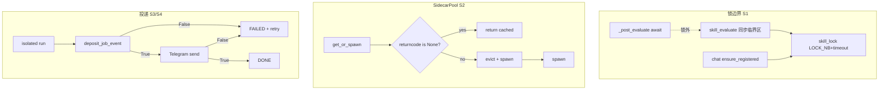

# 230 · 可靠性：锁不跨 await、sidecar 重生、投递失败即失败

- Issue: [#230](https://github.com/xforce-io/alfred/issues/230)
- L1: [issue comment](https://github.com/xforce-io/alfred/issues/230#issuecomment-5661453305)（Approved 2026-09-14，人工批准）
- 状态：Approved
- 最后更新：2026-09-14

## 1 背景

三类可靠性缺陷会让 daemon 挂死、sidecar 死后永不恢复、或任务「成功」但用户什么都没收到：

1. **锁跨 await**：`skill_evaluate` 在 `with skill_lock()` 内 `await _post_evaluate()`（含 LLM）；`skill_lock` 是无超时阻塞 `fcntl.flock`；聊天路径经 `ensure_registered` 在事件循环内同步抢同一把锁 → evolve 期间聊天可卡死整个 daemon。同类无超时锁还见于 `review_lock`、`routine_manager._save_task_list`。
2. **sidecar 死亡不重生**：`SidecarPool._get_or_spawn_locked` 只判 `existing is None`，从不检查 `returncode`；死进程仍被复用，表现为连续 `Connection refused`。
3. **投递失败被当成功**：Telegram 重试耗尽后丢弃；`inspector` / `cron` 忽略 `deposit_*` 返回值仍标 DONE；空 LLM 输出被 `is_silent_isolated_output` 当静默。

## 2 名词解释

| 规范名 | 定义 |
|---|---|
| skill_lock | 每技能 eval 目录下 `.lock` 的跨进程排他锁（`_atomic_io.skill_lock`） |
| sidecar | daemon 为 agent 拉起的 `milkie serve` 子进程；由 `SidecarPool` 缓存 |
| deposit 成功 | `deposit_mailbox_event` / `deposit_job_event` 返回 `True` |
| 显式静默 | isolated 输出首个非空行恰好为 `NO_USER_MESSAGE` |
| 投递失败 | mailbox/history 写入失败，或 Telegram 在重试耗尽后仍未成功 |

## 3 目标与非目标

**目标**
1. 事件循环内所有 `fcntl.flock` 调用均为 `LOCK_NB` + 超时（≤5s）失败抛错；`skill_lock` 作用域内零 `await`。
2. 池内检测到 sidecar 已退出（`returncode is not None`）或 chat `ConnectError` → 驱逐并重生；kill 后首个请求恢复。
3. mailbox/history 投递失败 → 任务 `FAILED` + retry，不得标 `DONE`。
4. Telegram 推送失败不得静默丢弃：报告仍可被用户最终收到（mailbox 锚 + 任务失败重试）。
5. 仅显式 `NO_USER_MESSAGE` 为静默；空/`None` 输出 → 失败 + ERROR + retry。

**非目标**
- scheduler 并发化与 `stop()` 顺序（另立）
- 同步 httpx → Async（另立）
- 新的跨主机分布式锁 / 外部队列产品
- 改变 isolated 成功时的投影/溯源语义（#127/#130）

## 4 能力

### 4.1 UI/UX

N/A。用户可感知：技能 evolve 时聊天 ≤2s 得到响应或明确「技能正在更新」类错误；sidecar 被杀后下一轮对话恢复；routine 投递失败会重试而非「成功但没收到」。

## 5 思路与折衷

| 决策 | 选择 | 放弃项及原因 |
|---|---|---|
| 锁 API | 扩展 `_atomic_io.skill_lock`（及 memory/routine 同类）为 `LOCK_NB` 轮询 + 超时；async 调用点优先 `asyncio.sleep` 轮询（对齐 `SessionPersistence.async_file_lock`） | 继续阻塞 `LOCK_EX`：与 S1 定量矛盾 |
| skill_evaluate 边界 | 锁内只做同步读改写；`await _post_evaluate` **移出**锁外；出锁前后校验 pointer | 整段 evaluate 持锁：LLM 分钟级必跨 await |
| 聊天抢锁失败 | 超时/BUSY → 明确错误回传，不阻塞 loop | 无限等待：与 ≤2s 矛盾 |
| sidecar 活性 | `get_or_spawn` 命中缓存时若 `returncode is not None` → pop + spawn；provider 遇 `ConnectError` → 驱逐后单次重试 | 仅依赖指纹重生：死进程指纹不变 |
| 投递与 DONE | `deposit_*` / 必要 history 返回 False 或抛错 → FAILED+retry；`inspector` 计入 deposited 必须基于 True | 只 WARNING 仍 DONE |
| TG 失败策略 | realtime 失败时确保内容在 mailbox，任务 FAILED 进入 retry；不引入独立出站表 | 独立 outbox：新存数，超本票 |
| 静默判定 | 仅非空且首个非空行 == `NO_USER_MESSAGE`；`None`/空 → 非静默，调用方 raise | 保留空=静默：掩盖 tool-only 空转 |

## 6 架构

**契约**
- `skill_lock(..., timeout=5.0)`：超时抛专用错误（可映射为用户可见「技能正在更新」）。
- `SidecarPool`：缓存命中必须通过活性检查；驱逐对调用方透明。
- 任务状态机：用户可见投递未成功 ⇒ 不得进入 `DONE`（跳过/闸门外的既有 DONE 语义保留）。
- `is_silent_isolated_output(result) -> bool`：空/`None` 为 False；仅显式 token 为 True。

## 7 验收映射

| Story | 设计落点 |
|---|---|
| S1 | 锁 API + evaluate 边界 + 聊天 BUSY |
| S2 | pool 活性检查 + ConnectError 驱逐重试 |
| S3 | deposit 返回值门禁 → FAILED |
| S4 | TG 失败 → mailbox 锚 + FAILED/retry |
| S5 | 静默判定收窄 |

## 8 风险

- `_post_evaluate` 出锁后与并发 evolve 竞态：出锁前后均校验 pointer/current_version（保持既有 stale skip）。
- FAILED 重试风暴：沿用既有 `build_retry_decision` / 可重试标记。
- TG 与 mailbox 双写顺序：先 mailbox 再 TG，或 TG 失败后补 mailbox，避免两端丢。
