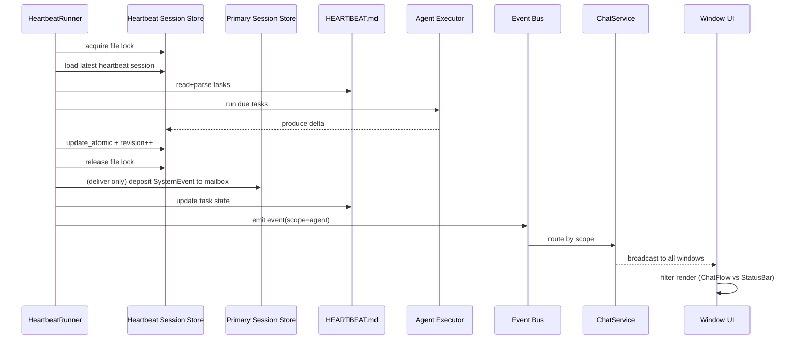
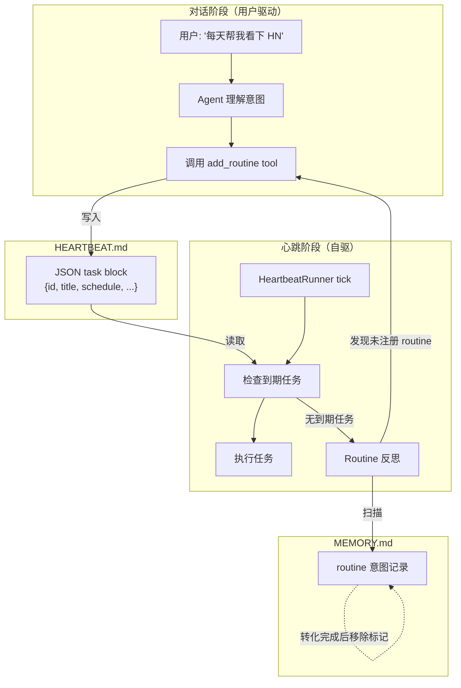
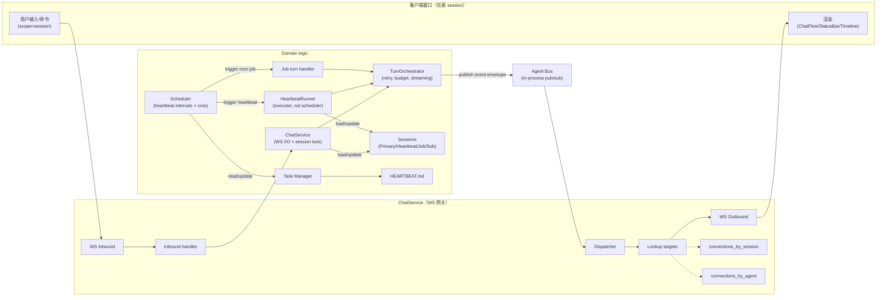
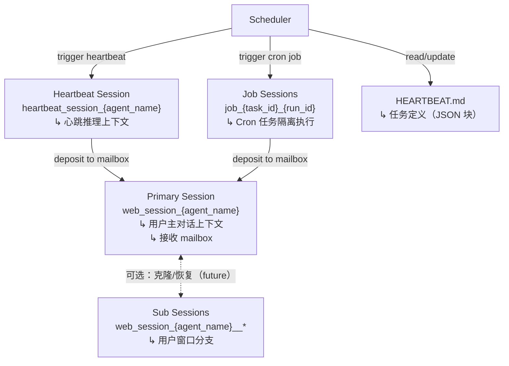

# EverBot 运行时架构设计（Runtime Architecture Design）

最后更新：2026-02-12

## 1. 文档目标

本文档定义 EverBot 的**完整运行时模型**——进程模型、LLM 推理流、Session 维护——以统一支撑以下四类活动：

| 活动 | 触发方 | 时效要求 | 上下文需求 | 产出 |
|------|--------|---------|-----------|------|
| 用户对话 | 用户输入 | 即时响应 | 完整聊天历史 | 直接回复 |
| 心跳巡检 | 定时器 | 可跳过 | 几乎不需要历史 | 静默或通知 |
| 定时任务（Cron Job） | cron 表达式 | 准时执行 | 任务专属上下文 | 结果桥接 |
| 多步后台作业 | 事件/手动 | 允许耗时 | 独立积累的多轮历史 | 完成后交付 |

同时解决以下工程问题：

1. **会话并发一致性**：消除双进程场景下 session 的 last-write-wins 覆盖与消息丢失
2. **Routine 闭环**：Agent 能从对话中学习 routine，自主写入任务清单，定期 proactive 执行
3. **心跳消息投递**：区分静默心跳与主动推送，让 Agent 像助理一样主动通知用户
4. **配置热更新**：workspace 配置文件变更后重启即生效，不被旧 session 覆盖
5. **调度分层**：心跳巡检与 cron 定时任务在调度和执行层面彻底分离
6. 多窗口下心跳状态不可见（广播粒度过细）
7. 会话历史损坏导致的 400 协议错误（工具调用链断裂）
8. 心跳任务表示弱结构化（仅依赖自然语言/正则）

**核心理念**：EverBot 不是"永远后台线程一直想"，而是**"后台按调度执行 + 结果桥接到主会话/外部渠道通知"**。心跳是 Agent 自主行为的载体——Agent 能记住用户的 routine 需求，主动注册为周期任务，并在心跳中自驱执行。

---

## 2. 当前实现快照（As-Is）

### 2.1 已有能力

1. 会话命名已规范：支持主会话 `web_session_{agent_name}`、分支会话 `web_session_{agent_name}__*`，以及心跳会话 `heartbeat_session_{agent_name}`。
2. Timeline 已带 `source_type` / `run_id`，UI 可按是否包含 heartbeat 过滤。
3. `DolphinStateAdapter.compact_session_state()` 已具备工具链序列校验与修剪能力（避免 `tool_calls → tool_response` 不配对）。
4. `everbot.status.json` 已有 daemon 级状态快照（agent 列表、心跳预览）。
5. Session 持久化已支持原子写入 + `_checksum` + `.bak` 回退（参考：`SessionPersistence.atomic_save()`）。
6. `HEARTBEAT.md` 已支持 JSON 块解析与任务状态机，并在心跳执行中优先使用（参考：`parse_heartbeat_md()` / `TaskState`）。
7. 双层锁已实现：进程内 `asyncio.Lock` + 跨进程 `fcntl.flock`。
8. 心跳获取不到锁时跳过（`HEARTBEAT_SKIPPED`），不硬抢。
9. 事件 pub-sub + `heartbeat_deliver` 事件类型已存在。
10. 确定性任务（如 `time_reminder`）可跳过 LLM，直接生成结果。

### 2.2 关键缺口

**运行时模型（本文档核心新增）：**

1. **缺少 Job Session 概念**：所有后台逻辑都压在心跳一个机制里。30 分钟跑一次的巡检和"每天 9 点发日报"本质不同，前者适合心跳，后者应该是独立 cron job，拥有隔离 session。
2. **桥接过于简单**：isolated 模式下结果桥接到主 session 是直接 `update_atomic` 追加消息，而非结构化事件注入。主 session 收到的应该是"你有一条后台通知"，而非伪造的 assistant message。
3. **调度未分层**：`HeartbeatRunner` 同时承担了心跳巡检和 cron 任务执行，没有独立的调度器。
4. **Context build 未按 session type 分支**：`workspace.py` 一把抓，所有 session type 看到相同的 system prompt。
5. **Workspace 文件读取无快照保护**：心跳执行时如果修改了 MEMORY.md 或 HEARTBEAT.md，下次主 session 的 prompt 可能读到中间状态。

**Routine 闭环：**

6. **HEARTBEAT.md 是静态的**：任务只能由人手动编辑，Agent 在对话中无法自主创建/修改 routine。
7. **Chat → Routine 没有桥**：用户在对话中说"以后每天帮我看看 XX"，Agent 无法将其持久化为 recurring task。
8. **心跳 prompt 只执行不反思**：不引导 Agent 反思"还有哪些 routine 应该注册"。
9. **MEMORY.md 与 HEARTBEAT.md 不连通**：用户 routine 意图可能记录在 MEMORY.md 中，但没有机制将其转化为可调度的 structured task。

**心跳消息投递：**

10. **心跳消息一刀切剥离**：`chat_service.py` 在聊天时 strip 所有心跳消息，导致 Agent 的主动推送也被吞掉。
11. **缺少 suppress/deliver 区分机制**：没有机制判断一条心跳结果是"静默确认"还是"需要推送给用户"。

**配置热更新：**

12. **Session 恢复覆盖新配置**：`restore_to_agent()` 将 session 文件中保存的旧 `workspace_instructions` 覆盖新值。

**基础设施：**

13. 后台事件分发仍是 `session_id → websocket` 的单点映射，缺少 `agent_name` 维度广播。
14. `HEARTBEAT.md` 任务状态写回仍是非原子写入。
15. 事件 envelope 尚未统一 schema/版本。

---

## 3. 设计取舍

### 3.1 立即落地

1. **统一运行时模型**：明确 Primary / Heartbeat / Job 三种 session type，各有独立的生命周期和 context build 策略。
2. **调度分层**：心跳巡检与 cron job 在调度和执行层面分离。
3. **事件桥接替代消息追加**：背景结果通过 SystemEvent 注入 primary session，而非伪造 assistant message。
4. **会话写一致性**：统一 `read → mutate → write` 原子更新入口，杜绝并发覆盖。
5. **心跳消息 suppress/deliver**：基于 `HEARTBEAT_OK` token 区分。
6. **workspace_instructions 热更新**：Session 恢复时不覆盖。
7. Agent 级广播。
8. `HEARTBEAT.md` 增加 JSON 块，结构化任务状态。

### 3.2 分阶段

1. **Routine Discovery 自动化**：Agent 在心跳中自动扫描 MEMORY.md，将 routine 意图转化为 scheduled task。
2. Shadow Session（子会话快照分支）：首期不做自动克隆。
3. Memory Flush（心跳事实回流）：应采用结构化事件摘要。
4. 外部渠道投递（WhatsApp/Telegram 等）：当前为单用户本地系统，不需要多渠道投递复杂度。

### 3.3 不做

1. **通用 Condition DSL**：不做内建的 condition 表达式引擎。条件判断交给 LLM。
2. 复杂的 Self-Healing 推断修复。但仍需要最小的格式校验与协议校验/最小修复。
3. 重型 Gateway 进程：先做进程内 Agent Bus。
4. 多渠道投递引擎：alfred 是单用户本地系统，投递层可以简化。OpenClaw 需要支持 WhatsApp/Telegram/Discord，我们不需要照搬那层复杂度。

---

## 4. 运行时模型（Runtime Model）

这是本文档的核心章节，定义 EverBot 在进程、推理、会话三个维度的统一模型。

### 4.1 核心矛盾与设计原则

**核心矛盾**：LLM 调用是慢操作（秒~分钟），但同一个 session 的状态在一次 turn 内必须独占。

**设计原则**：

1. **并发单元是 session，不是进程**——同一 session 内 turn 串行，不同 session 间 turn 并发。
2. **背景 session 永远不读 primary 的 history**——如需用户上下文，只传结构化 briefing。
3. **桥接只传摘要/结构化结果**——不传完整 tool chain，不伪造 assistant message。
4. **推理会话与投递目标解耦**——session 决定上下文；delivery 决定发到哪。
5. **单写入口**——所有 session 落盘都走 `update_atomic`（进程间文件锁 + 版本校验）。

### 4.2 进程模型

#### 单进程 + 多 Session + Turn 级调度

```
┌──────────────────────────────────────────────────┐
│               Daemon Process (1个)                │
│                                                  │
│  ┌──────────┐  ┌──────────────┐  ┌────────────┐ │
│  │Scheduler │  │   Session    │  │  Event     │ │
│  │          │  │   Registry   │  │  Bus       │ │
│  │ heartbeat│  │              │  │            │ │
│  │ timers   │  │  primary     │  │  pub/sub   │ │
│  │ cron     │  │  heartbeat   │  │  bridging  │ │
│  │ watcher  │  │  job_xxx     │  │            │ │
│  └────┬─────┘  └──────┬──────┘  └─────┬──────┘ │
│       │               │               │         │
│  ┌────▼───────────────▼───────────────▼──────┐  │
│  │          Turn Executor (async)            │  │
│  │                                           │  │
│  │  同一时刻每个 session 最多 1 个 turn      │  │
│  │  不同 session 的 turn 可以并发            │  │
│  └───────────────────────────────────────────┘  │
│                                                  │
│  ┌───────────────────────────────────────────┐  │
│  │          Web/CLI Interface                │  │
│  │    (接收用户输入，推入 primary turn)       │  │
│  └───────────────────────────────────────────┘  │
└──────────────────────────────────────────────────┘
```

**为什么单进程就够：**

- 单用户本地系统，不需要水平扩展
- LLM 调用是 I/O bound，asyncio 天然适合并发等待
- 多 session 的 turn 可以用 `asyncio.gather` 并发（各自等自己的 API 响应）
- 避免了多进程间的文件锁、IPC 复杂度

**Turn 执行分两层：TurnOrchestrator + 消费层**

Turn 执行拆分为两层，策略统一但执行路径因传输层差异而分离：

| 层 | 组件 | 职责 |
|---|------|------|
| **TurnOrchestrator**（共享执行层） | `core/runtime/turn_orchestrator.py` | LLM 调用循环、重试策略、tool budget、failure signature 追踪、streaming 事件归一化。以 `AsyncIterator[TurnEvent]` 为输出接口。 |
| **消费层** | ChatService / HeartbeatRunner | 各自管理会话锁、agent 生命周期、结果投递。ChatService 将 TurnEvent 推送到 WebSocket；HeartbeatRunner 收集 TurnEvent 后决定 suppress/deliver。 |

**为什么不统一为一个执行器**：ChatService 的 WebSocket 交互（用户中断、实时状态推送、连接管理）与 HeartbeatRunner 的后台执行语义本质不同。强行统一会让执行器变成满是 `if session_type` 分支的 God object。两者通过 `TurnPolicy`（可配置的策略参数）和 `ContextStrategy`（session type 特定的 prompt 构建）保持策略一致。

```python
@dataclass
class TurnPolicy:
    """可配置的执行策略，ChatService 和 HeartbeatRunner 各取所需"""
    max_retries: int = 3
    max_tool_calls: int = 14
    max_failed_tool_outputs: int = 3
    max_same_failure_signature: int = 2
    max_same_tool_intent: int = 3
    timeout_seconds: Optional[float] = None

class TurnOrchestrator:
    """共享执行层：重试 + budget + streaming 事件归一化"""

    async def run_turn(
        self,
        agent: DolphinAgent,
        message: str,
        *,
        system_prompt: str,
        policy: TurnPolicy,
        cancel_event: Optional[asyncio.Event] = None,
        on_before_retry: Optional[Callable] = None,
    ) -> AsyncIterator[TurnEvent]:
        """Yields: LLM_DELTA / TOOL_CALL / TOOL_OUTPUT / SKILL / STATUS / TURN_COMPLETE / TURN_ERROR"""
```

**TurnExecutor 的保留角色**：`TurnExecutor`（`core/runtime/turn_executor.py`）保留为 heartbeat/job session 的轻量 context strategy 分发层，负责 session 锁 + ContextStrategy 查表 + 调用 `agent.continue_chat()`。它不承担重试/budget 逻辑。

**关键点**：Dolphin `continue_chat()` 内部已处理 tool_calls → tool_response 的多轮循环、streaming、上下文管理。TurnOrchestrator 在其之上增加了重试、tool budget、failure signature 等运行时保护，以 `TurnEvent` 流的形式暴露给消费层。

用户对话和心跳可以同时进行——因为它们在不同 session 上。

#### 与现有双进程部署的关系

当前部署是 daemon + web 双进程（参考 4.6 双进程一致性协议）。单进程是推荐目标态，但不是一致性修复的前置条件。双进程下通过跨进程文件锁 + `update_atomic` 保证同等一致性语义。

### 4.3 Session 模型

#### 三种 Session，各有生命周期

```
┌─────────────────────────────────────────────────────┐
│                   Session Registry                   │
│                                                     │
│  ┌───────────────────────────────────────────────┐  │
│  │  Primary Session  (per agent, 长期存活)        │  │
│  │                                               │  │
│  │  session_id: web_session_{agent_name}         │  │
│  │  - 完整用户对话历史                            │  │
│  │  - 接收背景事件 (mailbox 队列)          │  │
│  │  - 用户下次发消息时, events 注入 context       │  │
│  └───────────────────────────────────────────────┘  │
│                                                     │
│  ┌───────────────────────────────────────────────┐  │
│  │  Heartbeat Session  (per agent, 短期复用)      │  │
│  │                                               │  │
│  │  session_id: heartbeat_session_{agent_name}   │  │
│  │  - 每次心跳可以复用或重建                      │  │
│  │  - 历史极短 (只保留最近 N 轮或清空)            │  │
│  │  - 产出: suppress / bridge to primary         │  │
│  └───────────────────────────────────────────────┘  │
│                                                     │
│  ┌───────────────────────────────────────────────┐  │
│  │  Job Session  (per execution, 完全隔离)        │  │
│  │                                               │  │
│  │  session_id: job_{task_id}_{run_id}           │  │
│  │  - 每次 cron 触发新建                          │  │
│  │  - 支持多 turn (复杂任务可积累对话历史)        │  │
│  │  - 完成后归档, 摘要桥接到 primary             │  │
│  └───────────────────────────────────────────────┘  │
│                                                     │
│  ┌───────────────────────────────────────────────┐  │
│  │  Sub Session  (用户窗口分支, 首期不做克隆)     │  │
│  │                                               │  │
│  │  session_id: web_session_{agent_name}__*      │  │
│  │  - 独立持久化                                  │  │
│  │  - 仅在 UI 层补足跨会话可见性                  │  │
│  └───────────────────────────────────────────────┘  │
└─────────────────────────────────────────────────────┘
```

#### Session 核心数据结构

每个 Session 本质上是一个 **Actor**——拥有独立状态、顺序处理消息、通过 mailbox 与其他 session 通信：

```python
@dataclass
class Session:
    session_id: str
    session_type: Literal["primary", "heartbeat", "job", "sub"]
    agent_name: str

    # 对话状态
    history: list[Message]         # 完整消息链
    variables: dict[str, Any]      # 运行时变量

    # 并发控制
    revision: int                  # 乐观锁版本号

    # Mailbox：session 间通信的唯一通道
    mailbox: list[SystemEvent]     # 待处理的入站事件

    # 生命周期
    state: Literal["active", "idle", "archived"]
    created_at: datetime
    updated_at: datetime
```

#### Mailbox：Session 间协同的核心原语

Session 之间不共享任何可变状态（history、variables 等）。所有跨 session 通信都通过 **mailbox 投递 SystemEvent** 完成：

```
┌──────────────────┐         SystemEvent          ┌──────────────────┐
│ Heartbeat Session│  ──── deposit to mailbox ──► │ Primary Session  │
│                  │                              │                  │
│ history (自己的) │  不读取 primary 的 history    │ mailbox:         │
│ mailbox (自己的) │  不写入 primary 的 history    │  - event1        │
│                  │                              │  - event2        │
└──────────────────┘                              └──────────────────┘
                                                         │
┌──────────────────┐         SystemEvent                 │
│   Job Session    │  ──── deposit to mailbox ──────────►│
│                  │                                     │
│ history (自己的) │                              用户下次发消息时
│ mailbox (自己的) │                              消费 mailbox 注入 message
└──────────────────┘
```

**Mailbox 语义**：

| 操作 | 说明 |
|------|------|
| `deposit(target_session_id, event)` | 向目标 session 的 mailbox 追加事件（通过 `update_atomic` 保证原子性） |
| `prepare_drain()` | 构建本轮要注入的事件快照与 `event_ids`（只读，不清空） |
| `ack_drain(event_ids)` | turn 成功后按 `event_id` 原子删除已消费事件 |

**为什么用 mailbox 而不是共享状态**：

1. **无竞态**：写入方只 append 到目标 mailbox，不读取目标的 history
2. **可审计**：每个 event 有 `event_id`、`source_session_id`，完整可追溯
3. **解耦生命周期**：生产者 session 可能已归档，但 event 仍在消费者 mailbox 中等待处理
4. **自然背压**：消费者按自己的节奏处理，不被生产者的频率驱动

#### Session 隔离原则

**背景 session 永远不读 primary 的 history。** 如果后台任务需要了解用户上下文，只传一个 briefing——这是 primary session 的结构化摘要，不是原始历史：

```python
# ❌ 错误：后台直接读主 session 历史
job_context = primary_session.history + job_message  # 污染 + 信息过载

# ✅ 正确：传递 briefing
briefing = summarize(primary_session)  # 结构化的当前状态摘要
job_session.variables["user_briefing"] = briefing  # 最小必要上下文
```

#### 心跳与 Cron Job 的本质区别

| | inline（心跳内执行） | isolated（独立 Job 执行） |
|--|------|----------|
| Session | 复用 heartbeat session | 每次新建 `job_{id}_{run_id}` |
| Agent | 复用 heartbeat agent | 新建 DolphinAgent |
| 可跳过 | 是（前台忙就跳过） | 否（排队等） |
| 多 Turn | 通常单 turn | 支持多 turn |
| 上下文 | 极简（任务列表） | 可以很重（专属指令 + 累积历史） |
| 结果 | suppress 或 deposit to primary mailbox | 必定 deposit to primary mailbox |
| 耗时预期 | < 30 秒 | 可能数分钟 |
| 并发影响 | 占用 heartbeat session 锁 | 独立锁，不阻塞任何人 |
| 开销 | 极低 | agent 创建 + session 持久化 |
| 适合 | 提醒、状态检查、短文本生成 | 工具链、数据采集、多步推理 |

### 4.4 LLM 推理流（Turn Lifecycle）

#### 一次 Turn 的完整生命周期

```
触发（用户输入 / 心跳 tick / cron 到期）
 │
 ▼
┌──────────────────────────┐
│  1. Session Lock +       │  TurnExecutor 负责
│     Agent Restore        │
│                          │
│  acquire session lock    │
│  load session from disk  │
│  restore DolphinAgent    │
│  (或为 job 新建 agent)   │
└─────────┬────────────────┘
          │
          ▼
┌──────────────────────────┐
│  2. System Prompt Build  │  ContextStrategy 负责
│                          │
│  strategy =              │
│    STRATEGIES[type]      │
│  system_prompt =         │
│    strategy.build_       │
│    system_prompt(        │
│      session, deps)      │
│                          │
│  注入内容因类型而异:      │
│    primary: + events     │
│    heartbeat: + tasks    │
│    job: + job instrs     │
└─────────┬────────────────┘
          │
          ▼
┌──────────────────────────┐
│  3. Dolphin Turn         │  Dolphin SDK 内部管理
│                          │
│  agent.continue_chat(    │
│    message=message,      │
│    system_prompt=...,    │
│    stream_mode="delta"   │
│  )                       │
│                          │
│  内部循环:                │
│    LLM call → tool_calls │
│    → tool execution      │
│    → LLM call → ...      │
│    → 直到无 tool_calls   │
│                          │
│  streaming events 实时   │
│  转发给上层              │
└─────────┬────────────────┘
          │
          ▼
┌──────────────────────────┐
│  4. Post-Turn            │  TurnExecutor 负责
│                          │
│  - save session          │    (从 agent 提取 history)
│  - ack mailbox drain  │  (clear consumed events only after successful turn)
│  - 状态转移              │    (task: running → done/failed)
│  - 产出评估              │    (决定是否桥接)
│  - release session lock  │
└─────────┬────────────────┘
          │
          ▼
┌──────────────────────────┐
│  5. Delivery Decision    │
│                          │
│  primary → 直接输出      │
│  heartbeat:              │
│    HEARTBEAT_OK          │
│      → suppress          │
│    有实质内容            │
│      → bridge            │
│  job:                    │
│    生成 summary          │
│    → bridge to primary   │
│    + optional external   │
└──────────────────────────┘
```

#### Context Build：Strategy 模式

Dolphin 的 `continue_chat(system_prompt=...)` 接受一个 system_prompt 参数来覆盖当前 turn 的系统指令，history 由 agent 内部的 `executor.context` 管理。因此 Strategy 的职责是**构建 system_prompt**，而非完整 context：

```python
# ── 运行时依赖，注入到所有 Strategy ──

@dataclass
class RuntimeDeps:
    workspace: WorkspaceLoader      # 加载 AGENTS.md / SKILLS.md / USER.md / MEMORY.md
    task_manager: TaskManager       # 管理 HEARTBEAT.md 中的任务

# ── Strategy 协议 ──

class ContextStrategy(Protocol):
    def build_system_prompt(self, session: Session, deps: RuntimeDeps) -> str:
        """构建本次 turn 的 system_prompt，传给 Dolphin continue_chat()"""
        ...

    def build_message(
        self, session: Session, trigger: str, deps: RuntimeDeps
    ) -> tuple[str, list[str]]:
        """Return (message_text, mailbox_ack_ids) for post-turn ack."""
        ...

# ── 各 Session Type 的具体策略 ──

class PrimaryContextStrategy:
    """用户对话：system_prompt 稳定，背景事件注入 message"""
    def build_system_prompt(self, session, deps):
        # system_prompt 只包含稳定内容，最大化 prefix cache 命中
        return deps.workspace.load_instructions()

    def build_message(self, session, trigger, deps):
        # 易变内容（背景事件）前置注入到 message，不污染 system_prompt
        parts = []
        consumed_event_ids = []
        if session.mailbox:
            parts.append("## Background Updates")
            for event in session.mailbox:
                parts.append(f"- [{event.source}] {event.summary}")
                consumed_event_ids.append(event.event_id)
            parts.append("")  # 空行分隔
        parts.append(trigger)
        return "\n".join(parts), consumed_event_ids

class HeartbeatContextStrategy:
    """心跳巡检：system_prompt 追加心跳指令（稳定），任务列表注入 message"""
    def build_system_prompt(self, session, deps):
        # 心跳间隔 30 分钟，cache 通常已冷，追加稳定指令可接受
        return deps.workspace.load_instructions() + HEARTBEAT_INSTRUCTIONS

    def build_message(self, session, trigger, deps):
        # 每次到期任务不同，走 message 注入
        parts = [trigger]
        due_tasks = deps.task_manager.get_due_tasks()
        if due_tasks:
            parts.append("\n## Due Tasks")
            for task in due_tasks:
                parts.append(f"- [{task.id}] {task.title}: {task.description}")
        return "\n".join(parts), []

class JobContextStrategy:
    """Cron Job：基础指令 + 任务专属指令"""
    def build_system_prompt(self, session, deps):
        # task-specific instructions should be attached when creating the job session
        job_instructions = session.variables.get("job_instructions", "")
        return deps.workspace.load_instructions() + "\n\n" + job_instructions

    def build_message(self, session, trigger, deps):
        return trigger, []

# ── 注册表（按 session_type 注册）──

CONTEXT_STRATEGIES: dict[str, ContextStrategy] = {
    "primary":   PrimaryContextStrategy(),
    "heartbeat": HeartbeatContextStrategy(),
    "job": JobContextStrategy(),  # read task-specific instructions from session.variables
}
```

**与 Dolphin Agent 的协作关系**：

```
TurnExecutor                          Dolphin Agent
    │                                      │
    ├─ strategy.build_system_prompt()      │
    │  → 稳定内容，最大化 prefix cache     │
    │                                      │
    ├─ strategy.build_message()            │
    │  → 易变内容注入 message              │
    │    (events / due tasks / ...)        │
    │                                      │
    ├─ agent.continue_chat(                │
    │    message=message,                  │
    │    system_prompt=system_prompt,  ────►│ Dolphin 内部：
    │    stream_mode="delta"               │   1. 替换本轮 system prompt
    │  )                                   │   2. 追加 message 到 history
    │                                      │   3. 调用 LLM
    │  ◄──── streaming events ─────────────│   4. 处理 tool_calls → tool_response
    │                                      │   5. 循环直到 LLM 不再调用 tool
    │                                      │   6. 更新内部 context/history
    │                                      │
    ├─ session_manager.save_from_agent()   │
    │  → 从 agent 内部状态提取 history     │
    │    持久化到 session.json             │
```

#### Prefix Cache 优化

LLM provider（如 Anthropic、OpenAI）对请求做 prefix caching：如果连续请求的前缀 token 序列相同，KV cache 可复用，降低延迟和成本。

**设计原则：system_prompt 保持稳定，per-turn 易变内容走 message 注入。**

| 内容 | 放置位置 | 原因 |
|------|---------|------|
| workspace instructions (AGENTS.md 等) | system_prompt | 跨 turn 稳定，可缓存 |
| HEARTBEAT_INSTRUCTIONS | system_prompt | 心跳 session 内稳定 |
| mailbox | message 前置 | 每轮可能不同 |
| due tasks 列表 | message 前置 | 每轮可能不同 |
| job instructions | system_prompt | 同一 job 内稳定 |

这样 primary session 的连续对话中，system_prompt 完全不变，prefix cache 命中率最高。背景事件只在有通知时注入 message，消费后 message 恢复正常，不影响后续 turn 的缓存。

**设计考量**：

- **为什么不用 Session 继承？** Session 是纯数据对象（持久化状态：history, revision, mailbox）。system_prompt 构建依赖 workspace、task_manager 等外部组件，如果塞进 Session 子类会让 Session 从数据对象膨胀为 God object，耦合运行时依赖。
- **Strategy 的优势**：Session 保持可序列化、可测试；新增 session type 只需加一个 Strategy 类 + 注册一行，不修改已有代码（OCP）。
- **TurnExecutor 通过 `session.session_type` 查注册表获取 strategy**，无需 if/elif 分支（参考 4.2 Turn Executor 概念模型）。
- **History 由 Dolphin 管理**：不同 session type 的 history 策略差异（primary 完整保留、heartbeat 极短、job 独立积累）通过 agent 恢复时决定——heartbeat agent 每次只恢复最近 N 轮或清空，primary agent 完整恢复。这不是 Strategy 的职责，而是 session 恢复逻辑的职责。

**重要**：`workspace.load_instructions()` 应做快照读取（读一个一致版本），避免读到后台正在写入的中间状态文件。

### 4.5 Mailbox 投递与消费

#### 投递：deposit

背景 session 完成 turn 后，通过 `deposit` 将结果投递到目标 session 的 mailbox：

```python
async def deposit(target_session_id: str, event: SystemEvent):
    """原子投递：向目标 session 的 mailbox 追加事件"""
    async def mutator(session: Session):
        session.mailbox.append(event)
    await session_store.update_atomic(target_session_id, mutator)
```

投递操作只 append，不读取目标 session 的任何其他字段（history、variables 等）。这保证了生产者和消费者之间零耦合。

#### 消费：drain（两阶段）

Primary session 在用户发消息触发 turn 时，`build_message()` 只读取 mailbox 快照，不直接清空：

```python
class PrimaryContextStrategy:
    def build_message(self, session, trigger, deps):
        parts = []
        consumed_event_ids = []
        if session.mailbox:
            parts.append("## Background Updates")
            for event in session.mailbox:
                parts.append(f"- [{event.event_type}] {event.summary}")
                if event.detail:
                    parts.append(f"  Detail: {event.detail}")
                consumed_event_ids.append(event.event_id)
            parts.append("")
        parts.append(trigger)
        return "\n".join(parts), consumed_event_ids
```

turn 成功后，post-turn 阶段再执行 ack（原子删除）：

```python
async def ack_drain(session_id: str, consumed_event_ids: list[str]):
    async def mutator(session: Session):
        session.mailbox = [
            e for e in session.mailbox if e.event_id not in consumed_event_ids
        ]
    await session_store.update_atomic(session_id, mutator)
```

如果 turn 失败，不执行 `ack_drain()`，mailbox 保持不变，事件会在下一轮继续注入，避免消息丢失。

#### 完整流转

```
Background Session                              Primary Session
      │                                              │
      │  turn completes                              │
      │  产出结果                                     │
      │                                              │
      │  deposit(                                    │
      │    target = primary_session_id,              │
      │    event = SystemEvent(                      │
      │      event_type = "job_completed",      ────►│  mailbox:
      │      summary = "HN 日报已生成",              │    [event1, event2, ...]
      │      source_session_id = "job_hn_a3f8", │    │
      │      detail = "1. ... 2. ...",          │    │
      │    )                                    │    │
      │  )                                      │    │
      │                                              │
      │                                    用户发消息 │
      │                                         │    │
      │                                         ▼    │
      │                                  build_message()
      │                                  prepare_drain(snapshot)
      │                                  注入 message:
      │                                  "## Background Updates
      │                                   - [job_completed] HN 日报已生成
      │
      │                                   用户的消息内容"
      │                                         │
      │                                         ▼
      │                                  LLM 自然地在回复中
      │                                  提及后台结果
      │                                         │
      │                                         ▼
      │                                  post-turn success:
      │                                  ack_drain(event_ids)
```

#### 为什么不是伪造 assistant message

1. 伪造 assistant message 会让 LLM 以为是自己说的，上下文混乱
2. mailbox event 以 user message 前缀形式注入，LLM 理解为"系统通知"，自然决定如何转达
3. 用户看到的是 LLM 整合后的回复，不是机械插入的文字
4. 事件消费后即清空，不污染后续 turn 的 message

#### SystemEvent 数据结构

```python
@dataclass
class SystemEvent:
    event_id: str
    event_type: str           # "heartbeat_result" | "job_completed" | "job_failed"
    source_session_id: str    # 可回溯到具体执行 session
    timestamp: datetime

    summary: str              # 一句话摘要，必填
    detail: Optional[str]     # 完整内容，可选
    artifacts: list[str]      # 产出文件路径等

    # delivery control
    priority: int             # 0=info, 1=important, 2=urgent
    suppress_if_stale: bool   # drop if unread for too long
    dedupe_key: Optional[str] = None
```

### 4.6 调度层（Scheduler）

#### 统一调度器：按 execution_mode 分流

任务在 HEARTBEAT.md 中通过 `execution_mode` 字段声明执行方式：

- `inline`：在心跳 session 中执行（轻量、可跳过）
- `isolated`：每次新建 job session 执行（重型、必须执行）

**由 Agent 在创建任务时决定 `execution_mode`**。Agent 比框架更懂任务的复杂度——"每小时提醒喝水"显然是 inline，"每天抓取 HN 并生成摘要"需要工具链，应该 isolated。框架提供默认推断作为兜底：

```python
def infer_execution_mode(task: Task) -> str:
    """Agent 未指定 execution_mode 时的框架默认推断"""
    if task.timeout_seconds > 60:
        return "isolated"
    if task.description and len(task.description) > 200:
        return "isolated"
    return "inline"
```

**统一调度器：心跳间隔 + cron 任务**

Scheduler 是唯一的调度决策者，拥有两个调度维度：

1. **心跳间隔**（`AgentSchedule`）：按 `interval_minutes` 触发 HeartbeatRunner 执行
2. **Cron 任务**：按 `execution_mode` 分流为 inline（合并到心跳 turn）和 isolated（独立 job session）

HeartbeatRunner 不做调度决策——它只接受 Scheduler 的调用指令并执行。

> 关键约束：`isolated` 任务必须先原子 claim（`pending -> running`）再执行，防止多实例/重入 tick 的重复触发。

```python
@dataclass
class AgentSchedule:
    """Per-agent heartbeat scheduling state."""
    agent_name: str
    interval_minutes: int = 30
    next_heartbeat_at: Optional[datetime] = None
    active_hours: tuple[int, int] = (8, 22)

class Scheduler:
    """统一调度器：心跳间隔 + cron 任务分流。

    一次 tick() 调用处理所有调度决策：
    1. 触发到期的心跳 tick（interval 驱动）
    2. 收集到期任务，按 execution_mode 分流
    3. inline 任务合并到心跳 turn
    4. isolated 任务先 claim 再独立执行

    所有回调注入——Scheduler 对 agent/session/LLM 零感知。
    """

    async def tick(self, now: datetime) -> None:
        # Phase 1: 心跳间隔
        for schedule in self._agent_schedules.values():
            if not self._is_active_time(schedule, now):
                continue
            if schedule.next_heartbeat_at is not None and now < schedule.next_heartbeat_at:
                continue
            schedule.next_heartbeat_at = now + timedelta(minutes=schedule.interval_minutes)
            try:
                await self._run_heartbeat(schedule.agent_name, now)
            except Exception:
                logger.exception("Heartbeat tick failed for %s", schedule.agent_name)

        # Phase 2: Cron 任务
        due_tasks = self._get_due_tasks(now)
        inline_tasks, isolated_tasks = self._split_tasks(due_tasks)

        # inline: 合并到心跳 turn（per-agent 聚合）
        for agent_name, tasks in group_by_agent(inline_tasks):
            await self._run_inline(agent_name, tasks, now)

        # isolated: 先 claim 再独立执行（per-task 异常隔离）
        for task in isolated_tasks:
            try:
                if await self._claim_task(task.id):
                    await self._run_isolated(task, now)
            except Exception:
                logger.exception("Isolated task %s failed", task.id)

    async def run_forever(self) -> None:
        """Daemon 主循环只需调用此方法。"""
        while self._running:
            try:
                await self.tick()
            except Exception:
                logger.exception("Scheduler tick failed")
            await asyncio.sleep(self._tick_interval_seconds)
```

**与 Daemon 的关系**：Daemon 的 `start()` 方法只需 `self._scheduler = self._build_scheduler()` + `await self._scheduler.run_forever()`，不再自己维护 `next_run_at` 字典或独立的心跳触发循环。

**与 HeartbeatRunner 的关系**：HeartbeatRunner 的 `start()` / 内置 `while` 循环保留用于向后兼容（直接调用场景），但在 Daemon 统一调度模式下，HeartbeatRunner 仅通过 `run_once_with_options()` 被 Scheduler 回调驱动。

**容错**：
- 每个 heartbeat tick 和每个 isolated task 的执行都包在独立的 `try/except` 中，单个失败不影响其他
- `run_forever` 的 `tick()` 调用也有 `try/except`，防止整个调度循环挂掉

#### 两条路径的完整 Session 协同

##### Path A：inline（心跳内执行）

适合：时间提醒、简单状态检查、短文本生成

```
    Primary Session                 Heartbeat Session                HEARTBEAT.md
         │                               │                               │
 ── 创建 ────────────────────────────────────────────────────────────────────
         │                               │                               │
 用户: "每小时       │                    │                               │
  提醒我喝水"        │                    │                               │
         │                               │                               │
 Agent: add_routine  │                    │                               │
 (mode=inline) ──────┼────────────────────┼───── write task ────────────►│
         │                               │                               │
 ── 执行（Scheduler tick，到期）─────────────────────────────────────────────
         │                               │                               │
         │           Scheduler           │                               │
         │           inline task ───────►│                               │
         │                               │◄── read due tasks ────────────│
         │                               │                               │
         │                        build_system_prompt()                   │
         │                        build_message(含 inline task 内容)      │
         │                               │                               │
         │                        agent.continue_chat()                   │
         │                        (在 heartbeat session 内)               │
         │                               │                               │
         │                        结果: "该喝水了！"                      │
         │                        _should_deliver() → true                │
         │                               │                               │
 ── 桥接（通过 mailbox）────────────────────────────────────────────────────
         │                               │                               │
         │◄──── deposit(event) ──────────│                               │
         │  mailbox: [{                  │                               │
         │    type: heartbeat_result,    │── update task state ─────────►│
         │    summary: "该喝水了！"      │   (done, next_run_at)         │
         │  }]                           │                               │
         │                               │                               │
 ── 用户下次交互 ────────────────────────────────────────────────────────────
         │                               │                               │
 用户发消息 ►│                            │                               │
         │                               │                               │
  build_message()                        │                               │
  drain mailbox →                        │                               │
  "## Background Updates                 │                               │
   - [heartbeat_result] 该喝水了！       │                               │
                                         │                               │
   用户的消息"                            │                               │
         │                               │                               │
  LLM 回复: "顺便提醒你该喝水了。        │                               │
   关于你的问题..."                       │                               │
         │                               │                               │
  post-turn: ack_drain(consumed_event_ids) │                            │
```

##### Path B：isolated（独立 Job 执行）

适合：需要工具链的任务、耗时操作、需要多步推理

```
    Primary Session          Job Session                              HEARTBEAT.md
         │                  (待创建)                                       │
 ── 创建 ────────────────────────────────────────────────────────────────────
         │                                                                │
 用户: "每天 9 点     │                                                    │
  帮我看 HN 热门"     │                                                    │
         │                                                                │
 Agent: add_routine   │                                                    │
 (mode=isolated) ─────┼────────────────────────── write task ────────────►│
         │                                                                │
 ── 执行（次日 9:00，Scheduler tick）──────────────────────────────────────
         │                                                                │
         │  Scheduler 检测到 isolated due task                            │
         │  创建 job_hn_a3f8  │                                           │
         │                    │                                           │
         │             新建 DolphinAgent                                  │
         │             build_system_prompt(base + job instructions)        │
         │                    │                                           │
         │             Turn 1: continue_chat()                            │
         │               → 调用 _bash 抓取 HN                             │
         │               → tool_response 返回                             │
         │                    │                                           │
         │             Turn 2: continue_chat()                            │
         │               → 筛选文章、生成摘要                              │
         │               → 完成                                           │
         │                    │                                           │
 ── 桥接（通过 mailbox）────────────────────────────────────────────────────
         │                    │                                           │
         │◄── deposit(event) ─│                                           │
         │  mailbox: [{       │                                           │
         │    type: job_completed,                                        │
         │    summary: "HN 日报已生成",                                    │
         │    detail: "1. ... 2. ...",                                     │
         │    source_session_id:                                          │
         │      "job_hn_a3f8" │                                           │
         │  }]                │  归档 job session  ── update task ───────►│
         │                    │  state → archived     (done, next_run_at) │
         │                    ▼                                           │
         │               (文件保留供回溯)                                  │
         │                                                                │
 ── 用户下次交互 ────────────────────────────────────────────────────────────
         │                                                                │
 用户发消息 ►│                                                             │
         │                                                                │
  build_message()                                                         │
  drain mailbox →                                                         │
  "## Background Updates                                                  │
   - [job_completed] HN 日报已生成                                         │
     Detail: 1. LLM 推理加速新方案 2. ...                                  │
                                                                          │
   用户的消息"                                                             │
         │                                                                │
  LLM 回复: "你的 HN 日报出来了，今天有几个亮点..."                         │
  (可引用 detail，或引导查看 artifacts)                                     │
         │                                                                │
  post-turn: ack_drain(consumed_event_ids)                                │
```

**关键区别**：isolated path 中，Job session 与 primary session 的生命周期完全独立。Job 可以跑 5 分钟、执行多轮 tool call，期间用户照常聊天不受影响。完成后通过 mailbox 投递一个轻量 event，primary session 在下次 turn 自然消费。

**与现有 HeartbeatRunner 的关系**：现有 HeartbeatRunner 同时承担调度和执行。重构后，Scheduler 统一调度并按 `execution_mode` 分流，HeartbeatRunner 退化为"心跳 turn 的执行逻辑"，新增 JobExecutor 处理 isolated job turn。

---

## 5. 进程模型详细设计

### 5.1 As-Is：双进程（daemon + web）

默认启动方式是双进程（参考 `bin/everbot start`）：

1. **EverBot Daemon 进程**（`python -m src.everbot.cli start`）
   - 进程的唯一职责就是运行 `HeartbeatRunner`（每个 agent 一个 asyncio task）。
   - 读写：`HEARTBEAT.md`、session 文件、`everbot.status.json`（状态快照）、心跳日志。
   - 不提供 WebSocket/HTTP 服务；对外可观测性主要通过落盘快照与日志。

2. **EverBot Web 进程**（`uvicorn src.everbot.web.app:app`）
   - 提供 UI/HTTP/WebSocket：`ChatService` 负责对话 turn 执行与 WS 推送。
   - 进程内 `events` 只对**同一进程**有效。
   - 可提供"手动触发心跳"的入口。

双进程间的主要通信方式是**共享文件系统**（sessions、`HEARTBEAT.md`、`everbot.status.json`），而不是实时 IPC。

##### 双进程协同全景

```
┌─ 进程 A: Daemon ──────────────────┐    ┌─ 进程 B: Web ──────────────────┐
│                                   │    │                                │
│  HeartbeatRunner                  │    │  ChatService                   │
│  ├─ 每 N 分钟 tick 一次            │    │  ├─ WebSocket 连接时            │
│  │  ├─ 读磁盘 session             │    │  │  ├─ 读磁盘 session           │
│  │  ├─ restore → 内存 agent       │    │  │  ├─ restore → 内存 agent     │
│  │  ├─ 读 HEARTBEAT.md            │    │  │  └─ 缓存 agent              │
│  │  ├─ agent.continue_chat()      │    │  │                             │
│  │  ├─ 写磁盘 session             │    │  ├─ 每条用户消息               │
│  │  └─ emit() → 空(_subscribers=0)│    │  │  ├─ 用内存 agent（不读磁盘）  │
│  └─ 结果写 heartbeat.log          │    │  │  ├─ agent.continue_chat()    │
│                                   │    │  │  └─ 写磁盘 session           │
└───────────┬───────────────────────┘    └──┬─────────────────────────────┘
            │                               │
            ▼           共享文件系统          ▼
      session.json ◄──── 唯一协同通道 ────► session.json
      HEARTBEAT.md                         (同一文件)
```

##### 双进程下的已知协同问题

1. **events.emit() 跨不了进程**：daemon 进程中 `events._subscribers` 为空，`emit()` 直接 return。
2. **Web 不主动重读磁盘**：WebSocket 连接建立时读一次 session，之后全部用内存缓存。
3. **last-write-wins 覆盖**：daemon 写完 session 后，Web 下次用过时的内存 agent 存盘，会覆盖 daemon 的心跳结果。
4. **锁不跨进程**：`asyncio.Lock` 只在 daemon 进程内有效。

### 5.2 To-Be（Phase A）：双进程一致性协议（先止血）

在现有部署现实下（daemon + web 并存），先建立**跨进程可验证的一致性协议**。核心原则：
`session.json` 是唯一真相源，内存 agent 只是缓存，不允许直接覆盖写盘。

**必须落地的协议：**

1. 所有会话写入统一走 `SessionStore.update_atomic(session_id, mutator)`。
2. 锁采用"双层锁"：
   - 进程内：`asyncio.Lock`（减少同进程竞争）
   - 进程间：`fcntl.flock`（保护 daemon 与 web 互斥）
3. 锁区间必须覆盖完整 `read → mutate → write`，禁止"旧内存快照直接 save"。
4. 心跳获取不到锁时返回 `HEARTBEAT_SKIPPED`，保持回避机制语义。
5. 聊天 turn 在进入执行前必须获取同一把 session 锁，确保用户消息优先落盘。

**标准写入流程（伪代码）：**

```python
async def update_atomic(session_id, mutator, *, timeout_sec):
    async with in_process_lock(session_id):
        with file_lock(f"{session_id}.lock", timeout=timeout_sec):
            latest = load_session_from_disk(session_id)  # main + .bak fallback
            working = clone(latest) if latest else new_session(session_id)
            mutator(working)  # append user msg / append heartbeat msg / update timeline
            working.revision = (latest.revision if latest else 0) + 1
            atomic_save_json(session_id, working)  # tmp + fsync + rename + .bak
```

**Phase A 的收益：**

| 5.1 的问题 | Phase A 后 |
|------------|-----------|
| last-write-wins 覆盖 | 进程间互斥 + 锁内重读，覆盖窗口被消除 |
| 锁不跨进程 | `flock` 让 daemon/web 共享同一把锁 |
| Web/daemon 各自 stale agent | 每轮写入前锁内重读最新 session，缓存只作为加速层 |
| 心跳回避失效 | 锁失败即 `HEARTBEAT_SKIPPED`，行为可观测 |

### 5.3 To-Be（Phase B）：单进程合并（目标态）

单进程合并仍是推荐目标态，但不再作为一致性修复的前置条件。
完成 Phase A 后，即使暂不合并进程，也能保证会话不丢消息。

单进程收益主要体现在：

1. `events.emit()` 可直接触达 WebSocket 路由，实时广播链路更短。
2. 心跳与聊天可复用同一内存 agent，减少反复恢复成本。
3. 排障面更小（少一个进程边界）。
4. Scheduler 可以直接管理 Turn Executor 的 session 锁状态，无需文件锁。

### 5.4 一致性不变量（Invariants）

以下不变量必须在代码和测试中同时成立：

1. 同一 `session_id` 任意时刻只允许一个写入事务持锁执行。
2. 任意成功提交都必须让 `revision` 单调递增。
3. 任意事务提交后，`history_messages` 末尾不能丢失本次用户输入/心跳输出。
4. 心跳抢锁失败只能"跳过"，不能"绕锁写盘"。
5. 任何写盘失败不会产生半文件（只允许旧版本或新版本）。

---

## 6. 心跳运行时（Heartbeat Runtime）

心跳是服务端按 agent 维度运行的后台定时任务，默认使用独立的 Heartbeat Session 作为执行上下文，并通过事件桥接把重要结果投递到 Primary Session。

**并发安全（依赖 5.2 Phase A 协议）：**
1. HeartbeatRunner 与 ChatService 都通过 `update_atomic()` 修改 session。
2. 同一 `session_id` 的锁冲突时，心跳跳过、聊天等待或重试。
3. 任意一方执行前都要在锁区间内重读磁盘 session，禁止使用陈旧内存快照直接落盘。
4. 若执行器在锁外运行（例如 LLM 推理耗时），最终提交前需再次进入锁区间做合并提交。
5. 心跳与主会话分别加锁：`heartbeat_session_*` 与 `web_session_*` 独立；桥接投递时再单独进入主会话锁区间提交。

**每次心跳 tick：**
1. `HeartbeatRunner` 触发一次 tick。
2. 尝试获取 Heartbeat Session 的进程间锁；失败则 `HEARTBEAT_SKIPPED`。
3. 锁内重读最新心跳 session，构建本轮执行上下文。
4. 读取 `HEARTBEAT.md` 的 JSON 块，找出到期任务（`next_run_at <= now`）。
5. 执行任务并生成变更。
6. 通过 `update_atomic()` 提交心跳会话与 timeline（`revision +1`）。
7. 根据 suppress/deliver 判断是否需要投递；仅 deliver 时通过 SystemEvent 桥接到 Primary Session。
8. 原子写回任务状态（`HEARTBEAT.md`），并发送 `scope=agent` 事件。



### 6.1 心跳消息投递：Suppress / Deliver（HEARTBEAT_OK Token 机制）

**问题**：当前实现在 Web 聊天时一刀切剥离所有心跳消息（`strip_heartbeat_turns`），同时 deliver 路径又可能出现“实时推送 + 下次对话再注入”的重复可见性。

**设计**：由 Agent 自主决定一条心跳结果是否需要 deliver；**用户可见正文的唯一来源是 Primary mailbox**。WebSocket 只做“有新后台更新”的状态提示，不直接写聊天气泡正文。

#### 核心规则

1. 心跳执行后 Agent 产生一段回复文本。
2. 如果回复中包含 `HEARTBEAT_OK` token（出现在文本的**开头或结尾**），且去掉 token 后剩余内容 ≤ `ack_max_chars`（默认 300 字符）→ **suppress**：消息被丢弃，用户看不到。
3. 如果回复不含 `HEARTBEAT_OK`，或去掉 token 后剩余内容超过阈值 → **deliver**：写入 Primary mailbox，等待下一次 primary turn 注入 LLM 上下文。
4. deliver 时可额外发 `scope=agent` 状态事件（仅提示“有后台更新”），不承载正文，避免重复展示。

#### 行为矩阵

| 回复内容 | 行为 | 用户可见 |
|---------|------|------|
| `HEARTBEAT_OK` | suppress | 不可见 |
| `HEARTBEAT_OK` + ≤300字符 | suppress | 不可见 |
| `HEARTBEAT_OK` + >300字符 | deliver | 状态栏提示 + 下次对话注入 |
| 不含 `HEARTBEAT_OK` | deliver | 状态栏提示 + 下次对话注入 |

#### 实现要点

**HeartbeatRunner 侧**（`heartbeat.py`）：

```python
def _should_deliver(self, response: str) -> bool:
    """判断心跳结果是否应推送给用户"""
    stripped = response.strip()
    token = "HEARTBEAT_OK"
    if stripped.startswith(token):
        remaining = stripped[len(token):].strip()
    elif stripped.endswith(token):
        remaining = stripped[:-len(token)].strip()
    else:
        return True  # 不含 token → deliver
    return len(remaining) > self.ack_max_chars  # default 300
```

**ChatService 侧**（`chat_service.py`）：

不再一刀切 `strip_heartbeat_turns`。改为：

1. HeartbeatRunner 执行后，根据 `_should_deliver()` 判断结果。
2. **suppress**：只写入 Heartbeat Session 历史（用于心跳上下文连续），不投递到 Primary Session。
3. **deliver**：先写入 Heartbeat Session 历史，再通过 SystemEvent 桥接到 Primary Session 的 `mailbox`。
4. 对 deliver 事件，仅广播轻量 envelope（`type=status`, `has_unread_background_updates=true`, `event_id=...`）到同 agent 窗口，不发送正文。

**前端侧**：收到状态事件后更新状态栏/角标；聊天正文仍由 primary turn 在 drain mailbox 时统一产出，保证单一可见路径。

#### 与现有 strip 逻辑的关系

- **删除** `chat_service.py` 中对 `strip_heartbeat_turns` 的调用。
- **保留** 心跳消息在 Heartbeat Session 的 `history_messages` 中（保障心跳自身上下文连续）。
- **仅 deliver 消息**以 SystemEvent 形式进入 Primary Session 的 `mailbox`（正文来源唯一）。
- **WebSocket** 只广播状态提示，不广播正文，避免重复通知。

#### 配置

```yaml
heartbeat:
  ack_max_chars: 300          # suppress 阈值，默认 300
  realtime_status_hint: true  # 是否广播“有后台更新”的状态提示
```

### 6.2 Session 恢复与 workspace_instructions 热更新

**问题**：`restore_to_agent()` 在恢复 session 时，将 session 文件中保存的旧 `workspace_instructions` 覆盖了新值。

**根因**：`session.py:281-283` 的恢复逻辑不区分"对话状态变量"和"配置派生变量"。

**设计原则**：Session 中的变量分为两类：

| 类别 | 变量 | 恢复策略 |
|------|------|---------|
| 配置派生（从磁盘文件构建） | `workspace_instructions` | **不恢复**，始终从磁盘重新构建 |
| 运行时状态（session 特有） | `model_name`、`current_time`、`session_id` 等 | 正常恢复 |

**实现**：

```python
_NON_RESTORABLE_VARS = {"workspace_instructions"}

async def restore_to_agent(self, agent, session_data):
    context = agent.executor.context
    for name, value in session_data.variables.items():
        if name in self._NON_RESTORABLE_VARS:
            continue  # 保留 agent_factory 构建的新值
        if value is not None:
            context.set_variable(name, value)
```

### 6.3 确定性心跳任务（Deterministic Tasks）

`time_reminder` 这类任务不应依赖 LLM 自由生成。

**设计规则：**

1. 任务可分为两类：
   - `deterministic`：可由程序直接计算（当前时间、简单状态汇总等）
   - `llm`：需要推理和外部工具链
2. 对 `deterministic` 任务，HeartbeatRunner 直接生成结果并写入事件，不经过 `continue_chat()`。
3. 仅在 deterministic 执行失败时，才降级到 LLM 路径，并记录告警日志。

**建议输出约定（time_reminder）：**

```json
{
  "task_type": "time_reminder",
  "now_iso": "2026-02-12T10:07:00-08:00",
  "timezone": "America/Los_Angeles",
  "display": "当前时间：2026-02-12 10:07:00"
}
```

---

## 7. 通信层：Event Bus

### 7.1 事件 Envelope

在现有 `events.emit(session_id, data)` 之上升级为带 envelope 的事件：

```json
{
  "event_id": "evt_xxx",
  "timestamp": "2026-02-10T13:00:00+00:00",
  "agent_name": "demo_agent",
  "session_id": "web_session_demo_agent",
  "scope": "agent",
  "source_type": "heartbeat",
  "run_id": "heartbeat_xxx",
  "type": "status",
  "content": "后台心跳检查中..."
}
```

`scope` 约定：
1. `session`: 仅当前会话（如用户输入回显）
2. `agent`: 同一 agent 的所有活跃连接（如心跳状态）

### 7.2 投递失败处理

1. WebSocket close/error 后立即从索引中移除连接。
2. 广播时单个连接写入失败则静默丢弃，不阻塞其余连接。
3. 首期不做离线消息缓存，客户端重连后通过拉取最新 session 状态 + timeline 恢复上下文。

### 7.3 ChatService 路由策略

维护两类索引：

1. `connections_by_session: session_id → set[ws]`
2. `connections_by_agent: agent_name → set[(session_id, ws)]`

路由规则：
1. `scope=session`：只发到对应 `session_id`。
2. `scope=agent`：发到同 `agent_name` 全连接；客户端按 `event.session_id === currentSessionId` 决定展示层级。

### 7.4 前端展示策略

1. `event.session_id == currentSessionId`：按原逻辑写入聊天流。
2. `event.session_id != currentSessionId && source_type=heartbeat`：仅更新状态栏提示，不写入 chat bubbles，可写入 timeline。

---

## 8. Routine 管理：从对话到自主执行的闭环

### 8.1 整体流程



**三条 routine 来源路径：**

1. **对话显式注册**：用户在对话中提出 routine 需求 → Agent 通过 tool call 写入 HEARTBEAT.md。
2. **心跳反思发现**：心跳空闲时，Agent 回顾 MEMORY.md 和对话历史，发现未注册的 routine 意图并自主注册。
3. **手动编辑**：用户直接编辑 HEARTBEAT.md（保持人类可读可写）。

### 8.2 Routine Skill（CLI 工具）

当前实现通过 CLI 脚本 `routine_cli.py` 暴露 HEARTBEAT.md 的 task CRUD。Agent 在对话或心跳中通过 `_bash` 调用该脚本，而非 Dolphin 原生 tool（Dolphin SDK 暂不支持自定义 tool 注册）。

CLI 位置：`skills/routine-manager/scripts/routine_cli.py`

**CRUD 命令示例：**

```bash
WORKSPACE=~/.alfred/agents/<agent_name>
CLI=skills/routine-manager/scripts/routine_cli.py

# 添加周期任务
python $CLI --workspace $WORKSPACE add \
  --title "每日摘要" --description "汇总当天变更" \
  --schedule "1d" --execution-mode isolated

# 添加一次性任务（不设 --schedule，指定 --next-run-at）
python $CLI --workspace $WORKSPACE add \
  --title "2分钟后讲笑话" --description "讲一个程序员笑话" \
  --next-run-at "2026-02-13T12:00:00+00:00"

# 列出所有任务
python $CLI --workspace $WORKSPACE list

# 更新任务
python $CLI --workspace $WORKSPACE update \
  --id <task_id> --schedule "2h" --enabled true

# 删除任务（硬删除）
python $CLI --workspace $WORKSPACE remove --id <task_id> --hard
```

**参数说明：**

| 命令 | 必选参数 | 可选参数 |
|------|----------|----------|
| `add` | `--title` | `--description`, `--schedule`, `--next-run-at`, `--execution-mode`, `--timezone`, `--source`, `--timeout-seconds`, `--allow-duplicate` |
| `list` | (无) | `--include-disabled` |
| `update` | `--id` | `--title`, `--description`, `--schedule`, `--execution-mode`, `--timezone`, `--enabled`, `--timeout-seconds` |
| `remove` | `--id` | `--hard` |

**实现要点：**

1. CLI 内部调用 `RoutineManager` 的 CRUD 接口，操作 HEARTBEAT.md 中的 JSON task block。
2. 在 agent 的 AGENTS.md 中内联 CLI 命令模板，确保对话和心跳中都可发现和调用。
3. 写入 HEARTBEAT.md 使用 `atomic_save`，与心跳执行共享同一把 session 锁。
4. 未来如果 Dolphin SDK 支持自定义 tool 注册，可升级为原生 tool 调用方式。

### 8.3 心跳反思 Prompt

当前 `HEARTBEAT_SYSTEM_INSTRUCTION` 只有执行逻辑，增加反思阶段：

```python
HEARTBEAT_SYSTEM_INSTRUCTION = """
## 心跳模式

你正在执行定期心跳检查。

### 阶段 1：执行到期任务
查看任务清单中已到期的任务（state=pending 且 next_run_at <= 当前时间），
按优先级逐一执行。执行完成后简要汇报结果。

### 阶段 2：Routine 反思（仅当无到期任务时执行）
回顾 MEMORY.md 和近期对话上下文，判断是否存在：
- 用户提过但尚未加入任务清单的 routine 需求
- 已完成的一次性任务中暗含周期性模式
- 基于用户画像（USER.md）应主动发起的定期检查

如果发现，使用 routine_cli.py 的 add 命令注册为 scheduled task。
如果没有，回复 HEARTBEAT_OK。

### 行为规则
1. 对 routine CRUD（add/list/update/remove）可直接行动，无需额外确认
2. 涉及危险操作（如文件删除、系统配置修改、权限变更、网络配置）必须先请求用户确认
3. 新注册的 routine 默认从下一个调度周期开始执行，不在本次心跳中立即执行
4. 避免重复注册：先用 list 命令检查是否已存在相似任务
5. 使用 routine_cli.py 管理 routine，禁止直接编辑 HEARTBEAT.md
"""
```

### 8.4 MEMORY.md → HEARTBEAT.md 闭环

建议在 MEMORY.md 中用标记区分"事实记忆"和"routine 意图"：

```markdown
## 用户偏好
- 喜欢简洁的汇报风格
- 关注 AI/ML 领域

## Routine 意图
- 每天检查 Hacker News 热门 → [已注册: daily_hn_check]
- 每周五整理本周学习笔记 → [待注册]
```

**转化流程：**
1. 心跳反思阶段，Agent 读取 MEMORY.md 中的"Routine 意图"段。
2. 对于标记为"待注册"的条目，调用 `add_routine` 创建 task。
3. 创建成功后，将标记更新为"已注册: {task_id}"。
4. 不删除条目本身（保留可追溯性），仅更新标记状态。

**注意**：这一层是 convention 而非硬编码 schema。Agent 即使不遵循此格式，也能通过自然语言理解发现 routine 意图。

---

## 9. 架构总览





**读图要点：**
1. Scheduler 统一管理心跳间隔和 cron 触发，HeartbeatRunner 是纯执行器。
2. TurnOrchestrator 是共享执行层，提供重试、tool budget、streaming 事件归一化；ChatService 和 HeartbeatRunner 各自管理会话锁和结果投递。
3. 心跳和 Job 的结果通过 SystemEvent 桥接到 Primary Session，而非共享推理历史。
4. Primary Session 在用户下次发消息时消费 mailbox，注入 context。

---

## 10. 会话持久化：原子写入与损坏防护

### 10.1 设计原则

1. **写入原子性**：避免产生"半文件/截断文件"。
2. **格式校验**：即便文件完整，也可能因 bug/升级/手工编辑导致不符合预期 schema。
3. **协议校验与最小修复**：发现工具链不闭合时做最小裁剪（而非语义推断），避免恢复后触发 400。
4. **损坏回退**：校验失败时回退到上一份可用备份。

### 10.2 原子写入

```python
def atomic_save(path: Path, data: bytes):
    tmp = path.with_suffix(path.suffix + ".tmp")
    bak = path.with_suffix(path.suffix + ".bak")

    # 1) write tmp + fsync file
    with open(tmp, "wb") as f:
        f.write(data)
        f.flush()
        os.fsync(f.fileno())

    # 2) rotate old -> bak
    if path.exists():
        os.replace(path, bak)

    # 3) replace tmp -> path (atomic on POSIX)
    os.replace(tmp, path)

    # 4) fsync directory (best-effort, POSIX)
    try:
        dir_fd = os.open(path.parent, os.O_DIRECTORY)
        try:
            os.fsync(dir_fd)
        finally:
            os.close(dir_fd)
    except Exception:
        pass
```

### 10.3 损坏检测与回退

1. 会话文件增加头部校验字段（JSON 顶层 `_checksum`）。
2. 加载时校验失败 → 记录日志 → 回退到备份文件（`.bak`）。
3. 每次成功 `atomic_save` 后，将前一个版本保留为 `.bak`（仅保留最近一份）。
4. 若 `.bak` 也损坏或不存在 → 以空会话重新开始，记录告警日志。

### 10.4 写入时机

仅在一轮完整的执行结束后持久化（所有 `tool_calls` 的 `tool_response` 都已收到），不在执行中间写入，保证落盘内容始终是合法的消息序列。

补充：若必须在中断点写入（例如用户中断/工具中断），应以"可恢复检查点"为单位写入，并在落盘前做一次 `validate → (optional) repair`。

---

## 11. 任务表示：结构化 HEARTBEAT

保留 `HEARTBEAT.md` 人类可读性，增加 JSON 块：

````markdown
## Tasks

```json
{
  "version": 2,
  "tasks": [
    {
      "id": "daily_hn_check",
      "title": "Check Hacker News top stories",
      "description": "浏览 HN 首页，筛选与用户兴趣相关的文章，整理摘要",
      "schedule": "0 9 * * *",
      "timezone": "America/Los_Angeles",
      "execution_mode": "isolated",
      "source": "chat",
      "enabled": true,
      "state": "pending",
      "last_run_at": null,
      "next_run_at": "2026-02-12T09:00:00+00:00",
      "timeout_seconds": 120,
      "retry": 0,
      "max_retry": 3,
      "error_message": null,
      "created_at": "2026-02-11T14:30:00+00:00"
    }
  ]
}
```
````

### 11.1 字段说明

| 字段 | 类型 | 说明 |
|------|------|------|
| `id` | string | 任务唯一标识 |
| `title` | string | 任务标题（人类可读） |
| `description` | string | 任务执行指令 |
| `schedule` | string | cron 表达式或 interval（`30m`/`1h`/`2d`） |
| `timezone` | string | IANA 时区（如 `America/Los_Angeles`），用于解释 `schedule` |
| `execution_mode` | string | `inline`（心跳内执行）/ `isolated`（独立 job session）。由 Agent 决定，缺省时框架推断 |
| `source` | string | 来源：`manual` / `chat` / `heartbeat_reflect` |
| `enabled` | bool | 是否启用 |
| `state` | string | `pending` / `running` / `done` / `failed` |
| `last_run_at` | ISO-8601 | 上次执行时间 |
| `next_run_at` | ISO-8601 | 下次计划执行时间 |
| `timeout_seconds` | int | 单次执行超时 |
| `retry` / `max_retry` | int | 重试计数 / 上限 |
| `error_message` | string? | 最近一次失败原因 |
| `created_at` | ISO-8601 | 创建时间 |

### 11.2 兼容策略

- v1 task（无 `description`/`source`/`enabled`/`timezone` 字段）：解析时补默认值。
- `timezone` 缺失时默认继承 `agent.timezone`，再回退 UTC。
- v2 写入后的文件仍可被人类直接编辑。

### 11.3 时间字段约定

1. `last_run_at/next_run_at/created_at` 使用 ISO-8601 且带 timezone offset（推荐 UTC：`+00:00`）。
2. `schedule` 必须按 `task.timezone` 解释；若缺失，回退到 `agent.timezone`，再回退到 UTC。
3. cron 在 DST 切换时按时区日历推进；interval 按持续时长推进（例如 `30m` 总是 30 分钟）。

### 11.4 损坏检测与自修复

HEARTBEAT.md 可能因手动编辑失误、进程崩溃中断写入导致 JSON 块损坏。

#### 框架层：检测 + 快照保护

```python
def parse_heartbeat_md(content: str) -> ParseResult:
    """
    - ok: 正常解析
    - corrupted: JSON 块存在但解析失败
    - empty: 无 JSON 块（退回 legacy）
    """
```

**快照机制**：每次成功解析 + 执行完成后，将当前 task list 写入 `.heartbeat_snapshot.json`。

**检测到损坏时的框架行为：**
1. 记录 `WARNING` 日志。
2. 将损坏状态注入心跳上下文。
3. 不静默跳过——继续触发心跳 tick，但传入损坏上下文。

#### Agent 层：诊断 + 修复

Agent 在心跳 tick 中收到损坏上下文后，利用 Routine Tool 自主修复：

| 损坏程度 | Agent 行为 |
|----------|-----------|
| 小格式错误 | 通过 `add_routine` 逐一重建 |
| 部分字段缺失 | 结合快照补全 |
| JSON 完全不可解析 | 基于快照重建全部 routine |
| 快照也不存在 | 从 MEMORY.md 和对话历史重新发现 |

---

## 12. 实施路线

### Phase 0: 一致性止血 + 运行时骨架

目标：解决"消息丢失/覆盖"，同时建立运行时核心抽象（Session Actor、Mailbox、ContextStrategy），为后续 phase 提供基础设施。

**一致性：**

1. 引入跨进程文件锁（`fcntl.flock`）并与现有 `asyncio.Lock` 组成双层锁。
2. 新增统一入口 `update_atomic(session_id, mutator)`。
3. Chat 与 Heartbeat 的 session 写入全部改走统一入口。
4. 心跳抢锁失败返回 `HEARTBEAT_SKIPPED`。
5. Session 增加 `revision` 字段。

**运行时骨架：**

6. Session 数据结构新增 `session_type` 和 `mailbox: list[SystemEvent]` 字段。
7. 实现 `SystemEvent` 数据类。
8. 实现 `deposit(target_session_id, event)` —— 原子追加到目标 session 的 mailbox。
9. 实现 `ContextStrategy` Protocol + `PrimaryContextStrategy` + `HeartbeatContextStrategy`（基于 Dolphin `continue_chat(system_prompt=...)`）。
10. `PrimaryContextStrategy.build_message()` 在有 mailbox 事件时 drain 并注入 message 前缀，保持 system_prompt 稳定（prefix cache 友好）。
11. `restore_to_agent()` 跳过 `workspace_instructions` 恢复（配置热更新）。

验收：
- 并发压测下不再出现用户消息丢失；`revision` 无回退。
- Session 文件包含 `session_type` 和 `mailbox` 字段。
- 手动 deposit 一个 event 到 primary session 后，下次用户消息的 message 中可见该 event 摘要。
- 修改 AGENTS.md 后重启，新内容生效。

### Phase 1: 会话隔离、Suppress/Deliver 与调度分层

**会话隔离 + Mailbox 投递：**

1. HeartbeatRunner 默认切到 `heartbeat_session_{agent_name}` 执行推理。
2. 心跳结果通过 `_should_deliver()` 判断后，deliver 消息通过 `deposit()` 投递到 primary session 的 mailbox。
3. Chat history 加载移除一刀切 `strip_heartbeat_turns`，改为 mailbox 语义。
4. `time_reminder` 切换为 deterministic 执行路径。

**调度分层 + execution_mode：**

5. Task 数据结构新增 `execution_mode: inline | isolated`（由 Agent 决定，框架推断兜底）。
6. 新增 `Scheduler`：统一管理心跳和 cron 触发，替代 daemon 里直接 `asyncio.gather`。
7. Scheduler 按 `execution_mode` 分流：inline 合并到心跳 turn，isolated 新建 job session。
8. 实现 `JobContextStrategy`：为 isolated 任务构建专属 system_prompt。
9. Job session 完成后通过 `deposit()` 将摘要投递到 primary session 的 mailbox。

**通信层：**

10. 扩展事件 envelope：`agent_name/session_id/scope/source_type/run_id/deliver`。
11. ChatService 增加 `connections_by_agent` 路由与 agent 维度广播。

验收：
- 心跳推理历史不再污染主会话；主会话只在 mailbox drain 时看到 deliver 的结果。
- deliver 消息可见，suppress 消息不可见。
- isolated 任务在独立 job session 中执行，结果通过 mailbox 投递到 primary。
- 用户对话、心跳、job 可三路并发，互不阻塞。
- inline 任务在心跳中执行；isolated 任务在 job session 中执行。

### Phase 2: 可观测性与健壮性

1. 增加可观测指标：`lock_wait_ms`、`heartbeat_skipped_due_to_lock`、`heartbeat_deliver_count`、`heartbeat_suppress_count`、`job_session_created`、`mailbox_deposit_count`、`mailbox_drain_count`。
2. 增加 mailbox 投递去重（`event_id` 幂等键 + `suppress_if_stale` 超时丢弃）。
3. Workspace 文件读取加入快照保护（读一致版本，避免读到写入中间状态）。
4. Job session 归档与清理：完成后 state → archived，保留 N 天或 N 份后自动清理。

验收：锁竞争与投递行为可观测；mailbox 无重复事件；workspace 读取不会读到半写文件。

### Phase 3: 任务结构化与 Routine Tool

1. 升级 HEARTBEAT JSON schema 到 v2（新增 `description`、`source`、`enabled`、`execution_mode`、`timezone`、`created_at`）。
2. 实现 routine-manager skill (CLI)（add/list/update/remove），`add` 命令支持 `--execution-mode` 和 `--next-run-at` 参数。
3. 通过 AGENTS.md 内联 CLI 模板，对话和心跳中都可调用。
4. 任务状态流转标准化（`pending → running → done/failed`，recurring 自动回到 pending）。
5. 引入 `ParseResult`（ok/corrupted/empty）和 `.heartbeat_snapshot.json` 恢复底线。

验收：
- 用户对话中通过 routine CLI `add` 命令创建任务后，下一次 Scheduler tick 可按 `execution_mode` 正确执行。
- Agent 指定 `--execution-mode isolated` 时任务在 job session 中执行；指定 `inline` 时在心跳中执行。
- JSON 损坏不再静默跳过，能触发修复流程。

### Phase 4: 心跳反思与目标态收敛

1. 启用反思 prompt（无到期任务时扫描 MEMORY.md，自动发现 routine 并调用 `add_routine` 注册）。
2. 反思注册的 routine 标记 `source=heartbeat_reflect`，首次注册时通过 mailbox 通知用户。
3. 增加去重约束（反思前 `list_routines` 检查）。
4. 评估单进程合并收益与迁移成本，满足条件后推进。

验收：MEMORY.md 中"待注册 routine"能被自动转为调度任务且不重复创建；用户可通过对话审计和管理自动注册的 routine。

---

## 13. 测试计划

### 13.1 Unit Tests

**一致性：**
1. `update_atomic()`：锁内重读 + 提交后 `revision` 单调递增；mutator 抛错时不写盘。
2. 文件锁：同一 `session_id` 第二个写者超时失败；锁释放后可再次获取。

**Mailbox（Actor 通信）：**
3. `deposit()`：原子追加到目标 session 的 mailbox；并发 deposit 不丢事件。
4. `prepare_drain()` + `ack_drain()`：turn 成功才清空；turn 失败不丢事件。
5. `SystemEvent` 序列化/反序列化：持久化到 session.json 后可正确恢复。

**ContextStrategy：**
6. `PrimaryContextStrategy.build_system_prompt()`：只包含 workspace instructions，不包含 mailbox 内容。
7. `PrimaryContextStrategy.build_message()`：有 mailbox 事件时注入 message 前缀；无事件时原样返回 trigger。
8. `HeartbeatContextStrategy.build_system_prompt()`：包含 HEARTBEAT_INSTRUCTIONS。
9. `HeartbeatContextStrategy.build_message()`：注入 due tasks 列表。
10. `JobContextStrategy`：包含 job 专属指令。
11. Strategy 注册表：按 `session_type` 正确分派。

**Suppress/Deliver + Deterministic：**
12. `_should_deliver()` 判断逻辑（行为矩阵全覆盖）。
13. deterministic task（`time_reminder` 不调 LLM 返回正确时间）。

**配置热更新：**
14. `restore_to_agent()` 变量过滤：`workspace_instructions` 不被 session 覆盖。

**调度：**
15. `execution_mode` 推断：timeout > 60s → isolated；短任务 → inline。
16. Scheduler 分流：inline 任务合并到心跳 turn；isolated 任务创建 job session。
17. Scheduler tick：heartbeat skippable（session 忙时跳过）；isolated job not skippable。
18. Scheduler claim：同一 due task 并发触发时只能被一个执行器 claim。

**任务解析：**
19. `ParseResult`（ok/corrupted/empty）分类正确。
20. `execution_mode` 字段兼容：v1 task 无此字段时默认 `inline`。
21. `timezone` 字段兼容：缺失时按 `agent.timezone -> UTC` 回退。

### 13.2 Integration Tests

**一致性：**
1. **双进程并发写**：daemon + web 交错触发，验证 history 不丢用户消息。
2. **心跳回避**：chat 持锁期间 heartbeat 返回 `HEARTBEAT_SKIPPED`。

**Mailbox 端到端：**
3. **deposit → drain 完整链路**：heartbeat deliver → deposit to primary mailbox → 用户发消息 → build_message 注入 → LLM 回复中提及 → post-turn `ack_drain`。
4. **Job → Primary 桥接**：isolated job 完成 → deposit summary → 用户可见。
5. **多 event 合并**：多个后台任务完成后 mailbox 有多个 event，一次 drain 全部注入。

**Suppress/Deliver：**
6. `HEARTBEAT_OK` 静默消息不投递到 primary mailbox。
7. 有实质内容的心跳结果投递到 primary mailbox，用户可见。
8. deliver 事件不会“实时正文 + 下次注入”重复展示（实时仅状态提示）。

**调度分层：**
9. **inline 执行**：inline 任务在心跳 session 中执行，不创建新 session。
10. **isolated 执行**：isolated 任务创建 job session，多 turn 执行，结果 deposit 到 primary。
11. **isolated claim 幂等**：同一到期任务在并发 tick 下只会执行一次。
12. **三路并发**：用户对话 + 心跳 + job 同时进行，各自 session 独立推进，互不阻塞。

**配置 + 崩溃恢复：**
13. **配置热更新**：修改 AGENTS.md 后重启，聊天感知新配置。
14. **崩溃恢复**：写入中断后重启，session 从主文件或 `.bak` 恢复；mailbox 中未消费的 event 不丢失。

**Routine（Phase 3+）：**
15. **Routine 闭环**：chat 调用 `add_routine(execution_mode=isolated)` → Scheduler 触发 → job session 执行 → deposit 到 primary → 用户可见。

### 13.3 Regression Guard

1. 不影响现有单会话聊天流与中断恢复。
2. timeline 事件仍完整（`turn_start/turn_end/tool_call/tool_output`）。
3. 未加载 Routine Tool 时，心跳执行路径保持兼容（inline 任务在心跳中正常执行）。
4. suppress 心跳消息仍保留在 heartbeat session 历史（保障上下文连续）。
5. session.json 新增字段（`session_type`、`mailbox`）向后兼容：加载旧格式 session 时补默认值。
6. task schema 新增字段（`timezone`）向后兼容：旧任务可按回退规则继续执行。

---

## 14. 风险与回滚

### 风险

1. 多播后事件量增大，可能放大前端噪音。
2. 原子写入引入的 `.bak` 文件占用额外磁盘空间。
3. **Routine 膨胀**：Agent 在反思阶段过度注册 routine。
4. **Routine 质量**：Agent 从 MEMORY.md 中误读意图。
5. **锁竞争与饥饿**：高频 chat 可能导致 heartbeat 长时间抢锁失败。
6. **平台差异**：`fcntl.flock` 在非 POSIX 平台语义不同。
7. **Job Session 膨胀**：长期运行后 job session 文件堆积。

### 缓解

1. 心跳默认 `status` 级消息，详尽内容进入 timeline。
2. `.bak` 仅保留最近一份。
3. 单个 agent 的活跃 routine 数量设 soft limit（建议 20）。
4. 所有 Agent 自动注册的 routine 标记 `source=heartbeat_reflect`，用户可随时删除/暂停。
5. 暴露锁指标：`lock_wait_ms`、`lock_timeout_count`、`heartbeat_skipped_due_to_lock`。
6. 为文件锁提供适配层。
7. Job session 完成后自动归档（保留 N 天或 N 份后清理）。

### 回滚

1. Feature Flag: `session.atomic_update = true|false`。
2. Feature Flag: `heartbeat.broadcast_scope = session|agent`。
3. Feature Flag: `heartbeat.routine_reflection = true|false`。
4. Feature Flag: `scheduler.cron_jobs = true|false`（回退到 heartbeat 统一执行模式）。

---

## 15. 结论

本设计将 EverBot 的运行时模型从"所有东西都是心跳"升级为 **Actor 模型驱动的分层运行时**：

1. **Session = Actor**：每个 session 是独立执行单元，拥有自己的状态和 mailbox，session 间零共享、只通过 mailbox 通信。
2. **Mailbox 是唯一协同原语**：`deposit` 投递、`drain` 消费，原子性由 `update_atomic` 保证。无共享可变状态，无竞态。
3. **ContextStrategy 按 session type 分化推理流**：system_prompt 保持稳定（prefix cache 友好），per-turn 易变内容（mailbox events、due tasks）走 message 注入，基于 Dolphin `continue_chat(system_prompt=...)` 实现。
4. **Agent 决定 execution_mode**：任务在创建时由 Agent 判断走 inline（心跳内）还是 isolated（独立 job session），框架提供推断兜底。Scheduler 按 mode 分流。
5. **调度层解耦**：Scheduler 统一管理触发时机，inline 可跳过、isolated 必须执行、三路并发互不阻塞。
6. **先一致性、后能力**：Phase 0 建立运行时骨架（一致性 + Mailbox + Strategy），Phase 1 落地调度分层和投递语义，Phase 2+ 逐步增加可观测性、Routine Tool 和反思能力。

每个阶段可独立验收、可回滚，不阻塞现有部署形态。
